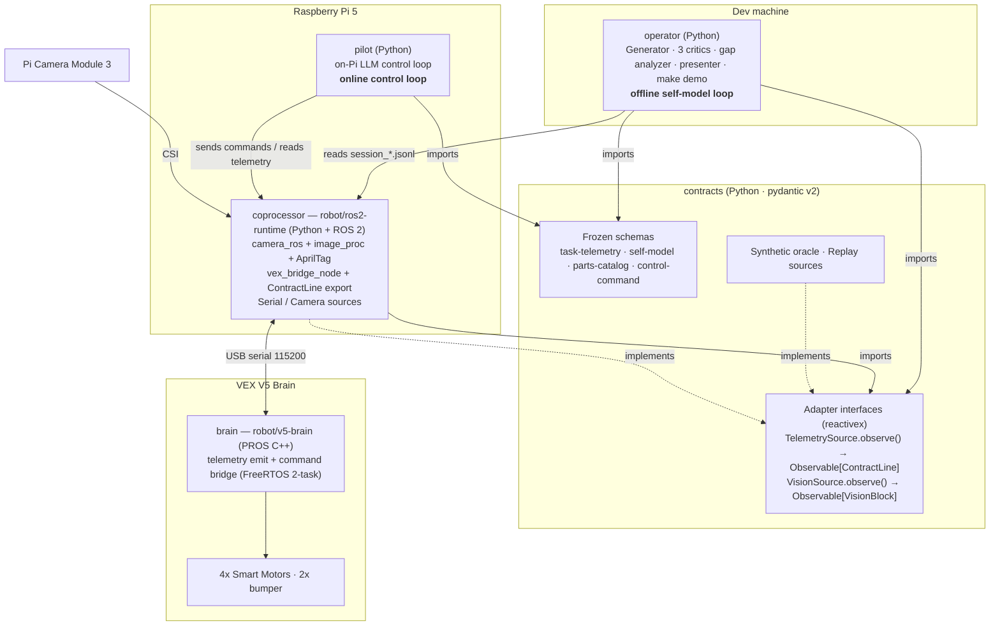
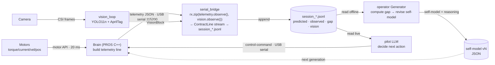

# Architecture

A **Physical-Robot Software Factory** driven by LLM-authored self-models. Given a finite typed parts vocabulary (VEX V5 Classroom Starter Kit), an LLM iteratively authors and revises a structured, language-readable self-description of a physical robot — what it *is*, what it *can do*, and what it *predicts* will happen on a task. Real-world motor telemetry closes the loop: gap residuals (predicted vs. observed) correct the self-model each generation.

**Novelty claim**: No published work combines language-authored self-models + multi-LLM adversarial critique + reality correction via per-actuator telemetry in a single generational loop. Lipson proved numerical self-models work; RoboMorph used LLMs for design in simulation only; Hart & Scassellati built symbolic self-models pre-LLM. The unoccupied position is this system.

> **Requirements authority.** [MASTER_REQUIREMENTS.md](MASTER_REQUIREMENTS.md) is the decision-closed source for scope, ownership, milestones, and verification. This document is the design narrative; where the two disagree, the requirements doc wins.

**Build strategy (software-first, reactive).** The MVP closes the loop in software: every telemetry and vision source sits behind a `TelemetrySource` / `VisionSource` adapter that returns a `reactivex.Observable` stream, so the same pipeline runs on recorded or synthetic data and expands to the full physical loop by swapping the adapter implementation — no pipeline change. Cold observables (`Replay`/`Synthetic`) emit on subscribe; hot observables (`Serial`/`Camera`) push frames in real time via a `Subject`. The ROS 2 bridge demultiplexes Brain telemetry/acks; the `pilot` online loop uses `flat_map` + `take_until` for bounded real-time control (ADR-20). Early milestones run on a parametric **synthetic oracle** — a hidden-ground-truth forward model whose true parameters are withheld from the Generator, so a tightening gap reflects the model actually converging on reality, not steering. The oracle is grounded by one real baseline capture once hardware is up. Code is organized into five verticals — `contracts`, `self_model_generator`, and `pilot` at the repo root, with `coprocessor` → `robot/ros2-runtime/` and `brain` → `robot/v5-brain/`. The Python verticals use `uv` + `ruff`; `brain` is **PROS C++** (PROS CLI + `arm-none-eabi`). Two loops run on this base: the **offline self-model loop** (`self_model_generator`, revising a readable design across generations) and the **online control loop** (`pilot`, an on-Pi LLM driving the robot in real time via a fixed control grammar).

## System Components

How the verticals stack — from the LLM software down to the motors. Every vertical imports its schemas from `contracts`; nothing else defines a schema.



## Data Flow

Who produces what, how it is transformed, and how it moves. The two loops share the telemetry + vision pipeline; they differ in the consumer (offline Generator vs. online pilot) and the direction of the last hop (revised design vs. live command).



> Transmission mechanisms: motor API (in-Brain), **USB serial 115,200** (Brain ↔ Pi, newline-delimited JSON, COBS off), **CSI** (camera → Pi), and the **append-only `session_*.jsonl`** file (Pi → operator). On the MVP path the `TelemetrySource`/`VisionSource` adapters resolve to cold `Replay`/`Synthetic` Observables; on hardware they resolve to hot `Serial`/`Camera` Observables — the `rx.zip` merge pipeline and all consumers are unchanged (ADR-20).

---

## Hardware Platform

### VEX V5 Brain

The deterministic motor-control layer. Runs a **PROS C++** program (`robot/v5-brain/`, FreeRTOS two-task) on a 20 ms tick: it drives all four Smart Motors, emits task telemetry as newline-delimited JSON on the USB user port (COBS disabled), and receives clamped control-grammar commands with a watchdog stop. C++ is required because VEXcode MicroPython is too slow for tight loops and cannot be confirmed to receive serial on the Brain.

- **Kit**: Classroom Starter Kit 276-7010 ($849)
- **Motors**: 4× V5 Smart Motor 11W — stall torque 2.1 Nm, continuous 0.735 Nm
- **Telemetry API** (per-motor, 20 ms loop): `torque()`, `current()`, `velocity()`, `position()`, `power()`
- **Sensors**: 2× Bumper Switch v2
- **Output**: newline-delimited JSON → USB serial, 115,200 baud

**Interface out**: JSON task-contract lines on `/dev/ttyACM0`. Format defined in [Telemetry Pipeline](#telemetry-pipeline).

### Raspberry Pi 5 Coprocessor

The data-collection layer. Runs two cooperating Python scripts: `vision_loop.py` (camera + ML) and `serial_bridge.py` (V5 ingest + JSONL storage). Pi 5 was chosen over Jetson Nano for 3× CPU advantage and USB-C power bank compatibility.

- **Camera**: Pi Camera Module 3, 12 MP, CSI 22-pin — 8–10 FPS YOLO, 30+ FPS blob/color
- **Vision**: YOLO11n NCNN INT8 for object detection; AprilTag (tag36h11) for robot pose `{x, y, heading}`
- **Power**: 10,000 mAh USB-C PD bank — ~3–5 W draw, 12–15 hr runtime
- **Weight**: ~280–350 g (board + case + camera + bank)

**Interface in**: JSON lines from `/dev/ttyACM0`. **Interface out**: `session_*.jsonl` on Pi filesystem — read directly by the operator's Claude Code session at analysis time.

---

## Robot Configuration

The typed assembly grammar — the bounded vocabulary the LLM searches over. Defining and maintaining this is its own owned work chunk: it is `parts_catalog.json`, and every other component reads from it.

**The Starter-Kit (276-7010) design vocabulary (post-PR-#16 narrowing — effector-encoded `motor_allocation`; single-value axes removed; `100rpm` dropped). The `flywheel` effector requires the 600 rpm cartridge; the `claw` requires the 200 rpm cartridge:**

```json
{
  "motor_allocation": ["2drive+1arm+1claw", "2drive+1arm", "2drive+1flywheel"],
  "end_effector":     ["claw_grasper", "scoop", "flywheel"],
  "cartridge":        ["200rpm", "600rpm"]
}
```

Valid configurations: **4** (claw 1 + scoop 2 + flywheel 1) under F3's rule set — `CLAW_MOTOR_BUDGET`, `SCOOP_ALLOCATION`, `FLYWHEEL_ALLOCATION`, `FLYWHEEL_CARTRIDGE`, `CLAW_CARTRIDGE`.

Generational ladder:

| Gen | Morphology | Key change |
|-----|-----------|------------|
| 0 | Speedbot | 2-motor drive only — baseline telemetry |
| 1 | Clawbot | Add arm + claw — grab/pull/throw tasks |
| 2–5 | Mutations | Arm position, gear ratio variants |

### Optional Hardware Expansions

Add-ons that extend the vocabulary without replacing the base kit. Each row is a deliberate purchasing decision — buy when the design loop reaches it, not upfront.

| Add-on | Cost | Vocabulary entry unlocked |
|--------|------|--------------------------|
| 6:1 cartridge (600 RPM) | ~$20 | `"cartridge": "600rpm"` — required by the flywheel effector |
| 2× additional omni wheels | ~$15 | Future `wheel_config` axis if reinstated |
| HS aluminum shafts | ~$10 | Longer arm reach, multi-stage linkages |
| 3D-printed end-effector | $3–5 | New `end_effector` value — produces telemetry the claw cannot |

3D-printed parts are the highest-leverage expansion: a scoop-cup end-effector is a genuine new vocabulary entry, can be iterated cheaply per generation, and produces continuous-contact telemetry vs. the claw's discrete jaw-close signal.

---

## Telemetry Pipeline

The data contract between the V5 Brain and the operator's Claude Code session. Owning this means owning the JSON schema — everything else in the system reads or writes to it.

**Data flow:**
```
V5 Brain → emit contract JSON → USB serial → Pi serial_bridge.py
  → merge with vision state → append to session_*.jsonl
  → operator opens Claude Code session → reads JSONL → revises self-model
```

**Task Telemetry Contract** — three blocks per task execution:

| Block | Content |
|-------|---------|
| `predicted` | Self-model's forward-simulated expectation before execution |
| `observed` | Actual motor API readings during execution |
| `gap` | Signed residuals — the only signal Claude needs to revise the model |

Storage: JSONL — append-only, `flush()` per contract, fast on Pi SD card. The operator's Claude Code session reads the file directly at analysis time; no API polling or streaming required.

**Interface contract**: `session_YYYYMMDD_HHMMSS.jsonl` on Pi filesystem. V5 Brain writes to it (via Pi bridge); Claude Code reads it. Both sides must agree on the JSON field names.

---

## LLM Integration

All LLM work runs through Claude Code (subscription) — no API keys, no billing per call, no scripted HTTP. The operator opens a Claude Code session, points it at the JSONL on the Pi, and drives the generational loop interactively.

### Self-Model & Generator

One owned piece: the self-model JSON schema plus the Claude Code workflow (prompts, slash commands, context-loading) that produces and revises it. Schema and workflow are designed together — the schema dictates what Claude must emit.

The self-model has four layers in a single versioned JSON document:

| Layer | Content |
|-------|---------|
| **Structural** | Typed graph of parts and connections drawn from `parts_catalog.json` |
| **Capability** | Physical parameters derived from specs: reach, torque, max pull force, CoM |
| **Predictive** | Forward-simulated outcome for the goal task |
| **Gap model** | Signed residuals from real execution — drives next-generation revision |

The `reasoning` field is first-class: Claude explains *why* it made each structural choice and what gap evidence drove each parameter change. This is the human-readable audit trail across generations.

At analysis time the operator loads the latest `session_*.jsonl` into the Claude Code session and asks Claude to revise the self-model. Claude reads the file directly — no intermediary script required.

### Critic LLM Panel

A separate owned piece — different workflow, different prompts, different output format. Runs *before* the human build step, so design errors are caught before a physical assembly is wasted.

- Parallel Claude Code subagents, each assigned a single attack dimension: physics validity, torque budget, CoM stability, reach geometry
- Each critic returns `pass` / `flag` + rationale; operator reviews and incorporates before finalizing the BOM
- Stateless relative to execution — reads only the proposed self-model, not telemetry; testable against synthetic self-models without a physical robot

---

## Generational Loop

The orchestration that ties all other chunks together. Not independently ownable — it's the integration spec.

| Stage | Owner | Inputs | Outputs |
|-------|-------|--------|---------|
| 1. Design | Operator + Claude Code | `parts_catalog.json` + prior gap residuals | Self-model JSON vN |
| 2. Critique | Operator + Claude Code agents | Self-model vN | Pass / revise flags |
| 3. Build | Human | BOM + ordered build steps | Physical robot Gen N |
| 4. Execute | V5 + Pi (autonomous) | Robot + task description | `session_*.jsonl` |
| 5. Analyze | Operator + Claude Code | `session_*.jsonl` gap blocks | Revised self-model vN+1 |

**Minimum Viable Demo (June 29):** The loop closes in software first (synthetic oracle, then grounded by a real baseline capture); the live Gen-2 segment runs on hardware with a recorded fallback ready.
1. Gen 0 Clawbot — LLM authors self-model from specs; run grab, pull, and throw tasks; collect telemetry (synthetic oracle, then real capture)
2. Show gap JSON — LLM explains residuals in plain language, revises self-model
3. Repeat grab/pull/throw — self-model correction converges across rounds; the oracle's hidden parameter is recovered within tolerance
4. Gen 1 / Gen 2 novel configuration — LLM proposes a new morphology from the grammar; human builds; runs same task suite
5. Compare generations — gap residuals tighten; design hypothesis confirmed or refuted by data

---

## Online Control Loop (`pilot`)

A second loop, distinct from the offline generational loop: an LLM running **on the Pi** drives the robot through an open-ended task in real time. It reads live telemetry + vision, decides the next action, and emits a single **fixed control-grammar** command (`control-command`, owned by `contracts`) to the Brain, which clamps and acks it; the loop repeats until the task completes, a limit is hit, or a human interrupts.

- **Bounded + interruptible** — hard iteration and wall-clock limits, a human kill switch, per-command `ttl_ms`, and the Brain's watchdog stop. Never an unbounded autonomous loop.
- **Informed by the offline loop** — the self-model / gap model produced by the generational loop conditions the pilot's decisions.
- **Open decisions (ADR-19):** the on-Pi LLM runtime likely needs an API key + network (revisits ADR-03/ADR-08); the telemetry-stream-vs-ack multiplex on the single USB port; and the command vocabulary beyond drive/turn/stop. The control grammar is therefore **draft**, not frozen.

---

## Aesthetic Vocabulary

A non-functional grammar extension giving the Generator LLM structured choices for **visual self-expression**. Separate from the functional grammar — aesthetic parameters don't affect motor commands or telemetry contracts. One owned piece.

The key insight: aesthetic choices can encode hypotheses and make them visible. "Wide side panels = testing mass distribution." "Forward antennae = prioritizing forward sensing." Generations become visually distinct without reading telemetry.

```json
{
  "body_panel":      { "material": ["corrugated_plastic", "craft_foam", "cardboard", "acrylic", "3d_print", "none"] },
  "surface_markings":{ "tape_pattern": ["none", "stripes", "chevron", "solid_block"] },
  "appendages":      { "type": ["none", "antennae", "swept_fins", "dorsal_ridge", "whiskers"] },
  "accent_lighting": { "type": ["none", "neopixel_strip", "neopixel_ring"],
                       "pattern": ["solid", "breathing", "chase", "generation_pulse"] }
}
```

All materials attach via existing VEX 0.5" square holes — velcro, zip ties, or screws. No drilling, no modification to metal. Budget: $0–25 per generation. NeoPixel on Pi 5 requires SPI method (GPIO 10) — standard PWM/DMA libraries are incompatible with Pi 5 hardware.

---

## Key Decisions

| Decision | Chosen | Why |
|----------|--------|-----|
| Coprocessor | Pi 5 over Jetson Nano | 3× faster CPU; USB-C power bank compatible; Jetson Nano EOL |
| Serial | USB 115,200 baud (Stage 1) | No extra hardware; proven; upgradeable to RS-485 Smart Port (Stage 2) without protocol change |
| Storage | JSONL over SQLite | Faster Pi SD writes; native Anthropic Batch API input format |
| Assembly | Human-in-the-loop | Full autonomy is low-feasibility at capstone scale; human is a formal manufacturing station, not ad-hoc |
| Localization | AprilTags over odometry | Wheel slip + snap-fit tolerances make pure odometry unreliable at this scale |
| Design space | Starter Kit only (~10–15 configs) | Small enough to exhaust in 3–5 gens; large enough to show real mutations |
| Build strategy | Software-first behind `TelemetrySource`/`VisionSource` adapters | Demoable loop in 4 days; full physical loop is a drop-in adapter swap, no contract change |
| Adapter pipeline model | `reactivex` Observable streams — `observe() -> Observable[T]` on both protocols; `rx.zip` merge in `serial_bridge`; `flat_map`/`take_until` in `pilot` | The whole pipeline is reactive: 20 ms hot motor ticks, hot camera frames, `rx.zip` merge, real-time LLM fan-out. Using Observable as the protocol return type makes `zip`, `buffer`, `retry`, and `take_until` first-class primitives rather than hand-rolled loops. Cold/hot split enforced at the concrete-source boundary (ADR-20) |
| Synthetic telemetry | Parametric hidden-ground-truth oracle | Honest gap — the LLM recovers parameters it never sees; not hand-authored, not a physics sim |
| Tooling | `uv` + `ruff` on the Python verticals; **PROS C++** on `brain` | One fast Python toolchain (replaces pip/poetry/black/isort/flake8); the Brain compiles via the PROS CLI + `arm-none-eabi` |
| Brain language | PROS C++ over VEXcode Python | MicroPython too slow for tight loops; Python serial-receive on the Brain unconfirmed; PROS bidirectional JSON is community-confirmed |
| Online control | First-class on-Pi LLM control loop (`pilot`) | Real-time autonomy alongside the offline self-model loop; fixed control grammar, bounded + interruptible (ADR-19) |

> Full decision log (ADR-01 … ADR-19) with rationale and rejected options: [MASTER_REQUIREMENTS.md → Closed Decisions](MASTER_REQUIREMENTS.md).
