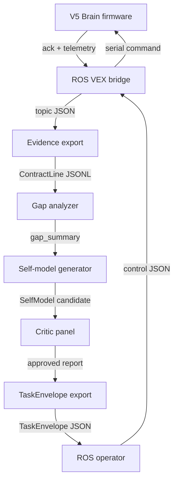
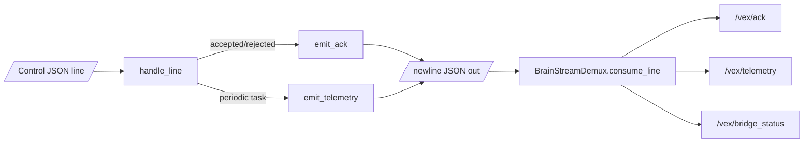
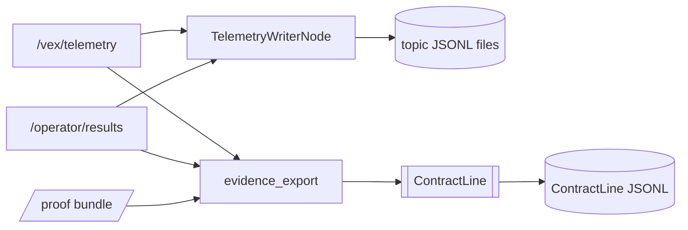
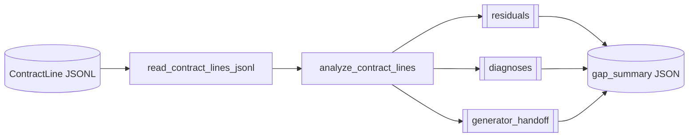
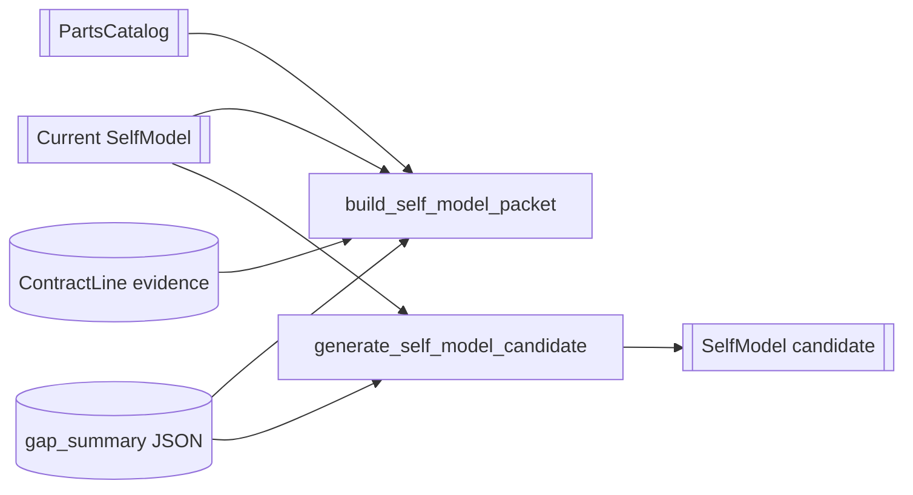
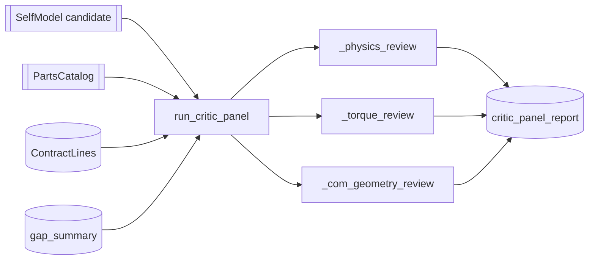
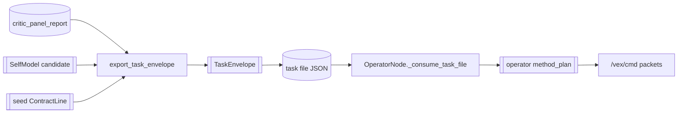

# Data Workflow

Implementation-derived Mermaid charts for the telemetry, gap analysis, self-model generation, critic, and robot IO workflow. Each chart has nine nodes or fewer. Every referenced input/output links to the implemented file that defines or emits it.

## High-Level Overview

### Top-Level Data Types

| Data type | Role | Defined by |
|---|---|---|
| `ControlCommand` / control JSON line | Robot command envelope sent from ROS/operator code to the V5 Brain over serial. | [`contracts/src/contracts/control_command.py`](contracts/src/contracts/control_command.py), [`robot/ros2-runtime/src/vexy_ros/bridge_protocol.py`](robot/ros2-runtime/src/vexy_ros/bridge_protocol.py) |
| `AckLine` | Brain acknowledgement for a command sequence, including state and health fields. | [`contracts/src/contracts/control_command.py`](contracts/src/contracts/control_command.py), [`robot/v5-brain/pros_bridge/src/main.cpp`](robot/v5-brain/pros_bridge/src/main.cpp) |
| Brain telemetry JSON | Raw Brain status and motor-sample stream emitted over serial. | [`robot/v5-brain/pros_bridge/src/main.cpp`](robot/v5-brain/pros_bridge/src/main.cpp) |
| `ContractLine` | Canonical evidence line consumed by offline analysis; carries prediction, motor samples, gap, outcome, vision, and source. | [`contracts/src/contracts/contract_line.py`](contracts/src/contracts/contract_line.py) |
| `gap_summary` | Analyzer output containing residual summaries, diagnoses, source metadata, and generator handoff. | [`self_model_generator/src/self_model_generator/gap_analyzer.py`](self_model_generator/src/self_model_generator/gap_analyzer.py) |
| `SelfModel` | Generation-versioned robot self-model revised from gap evidence. | [`contracts/src/contracts/self_model.py`](contracts/src/contracts/self_model.py) |
| `critic_panel_report` | Deterministic critic output with approval status and physics/torque/geometry reviews. | [`self_model_generator/src/self_model_generator/loop_closure.py`](self_model_generator/src/self_model_generator/loop_closure.py) |
| `TaskEnvelope` | Robot-facing task file: `ContractLine` plus an operator method outline. | [`contracts/src/contracts/task_envelope.py`](contracts/src/contracts/task_envelope.py) |

### Top-Level Nodes

## 1. V5 Serial Output Classification

| Node or payload | Implemented definition |
|---|---|
| `Control JSON line` | [`receive_task` -> `handle_line`](robot/v5-brain/pros_bridge/src/main.cpp) |
| `handle_line` | [`robot/v5-brain/pros_bridge/src/main.cpp`](robot/v5-brain/pros_bridge/src/main.cpp) |
| `emit_ack` / ack payload | [`emit_ack`](robot/v5-brain/pros_bridge/src/main.cpp), contract shape in [`AckLine`](contracts/src/contracts/control_command.py) |
| `emit_telemetry` / telemetry payload | [`emit_telemetry`, `motor_sample_json`, `motor_samples_json`](robot/v5-brain/pros_bridge/src/main.cpp) |
| `newline JSON out` | [`emit_json`](robot/v5-brain/pros_bridge/src/main.cpp) |
| `BrainStreamDemux.consume_line` | [`robot/ros2-runtime/src/vexy_ros/bridge_demux.py`](robot/ros2-runtime/src/vexy_ros/bridge_demux.py) |
| `/vex/ack`, `/vex/telemetry`, `/vex/bridge_status` | [`VexBridgeNode._publish_event`](robot/ros2-runtime/src/vexy_ros/vex_bridge_node.py) |

## 2. ROS Evidence to ContractLine JSONL

| Node or payload | Implemented definition |
|---|---|
| `/vex/telemetry` | [`VexBridgeNode._publish_event`](robot/ros2-runtime/src/vexy_ros/vex_bridge_node.py) |
| `/operator/results` | [`OperatorNode._publish_contract_result`](robot/ros2-runtime/src/vexy_ros/operator/node.py) |
| `proof bundle` | [`bundle_from_proof_dir` / `contract_payload_from_bundle`](robot/ros2-runtime/src/vexy_ros/evidence_export.py) |
| `TelemetryWriterNode` and topic JSONL files | [`robot/ros2-runtime/src/vexy_ros/telemetry_writer_node.py`](robot/ros2-runtime/src/vexy_ros/telemetry_writer_node.py) |
| `evidence_export` | [`contract_payload_from_bundle`, `contract_payload_from_operator_result`, `_motor_samples`](robot/ros2-runtime/src/vexy_ros/evidence_export.py) |
| `ContractLine` | [`contracts/src/contracts/contract_line.py`](contracts/src/contracts/contract_line.py) |
| `ContractLine JSONL` | Read by [`read_contract_lines_jsonl`](self_model_generator/src/self_model_generator/gap_analyzer.py) |

## 3. ContractLine JSONL to Gap Summary

| Node or payload | Implemented definition |
|---|---|
| `ContractLine JSONL` | [`read_contract_lines_jsonl`](self_model_generator/src/self_model_generator/gap_analyzer.py), each line validated as [`ContractLine`](contracts/src/contracts/contract_line.py) |
| `read_contract_lines_jsonl` | [`self_model_generator/src/self_model_generator/gap_analyzer.py`](self_model_generator/src/self_model_generator/gap_analyzer.py) |
| `analyze_contract_lines` | [`self_model_generator/src/self_model_generator/gap_analyzer.py`](self_model_generator/src/self_model_generator/gap_analyzer.py) |
| `residuals` | [`_residual_summary`](self_model_generator/src/self_model_generator/gap_analyzer.py) |
| `diagnoses` | [`_diagnose`](self_model_generator/src/self_model_generator/gap_analyzer.py) |
| `generator_handoff` | [`_generator_handoff`](self_model_generator/src/self_model_generator/gap_analyzer.py) |
| `gap_summary JSON` | [`write_gap_summary`](self_model_generator/src/self_model_generator/gap_analyzer.py) |

## 4. Gap Summary to SelfModel Candidate

| Node or payload | Implemented definition |
|---|---|
| `Current SelfModel` / `SelfModel candidate` | [`SelfModel`](contracts/src/contracts/self_model.py) |
| `PartsCatalog` | [`contracts/src/contracts/parts_catalog.py`](contracts/src/contracts/parts_catalog.py) |
| `ContractLine evidence` | [`ContractLine`](contracts/src/contracts/contract_line.py) |
| `gap_summary JSON` | [`analyze_contract_lines` output](self_model_generator/src/self_model_generator/gap_analyzer.py) |
| `build_self_model_packet` | [`self_model_generator/src/self_model_generator/packet_builder.py`](self_model_generator/src/self_model_generator/packet_builder.py) |
| `generate_self_model_candidate` | [`self_model_generator/src/self_model_generator/loop_closure.py`](self_model_generator/src/self_model_generator/loop_closure.py) |

## 5. SelfModel Candidate to Critic Report

| Node or payload | Implemented definition |
|---|---|
| `SelfModel candidate` | [`SelfModel`](contracts/src/contracts/self_model.py) |
| `PartsCatalog` | [`PartsCatalog`](contracts/src/contracts/parts_catalog.py) |
| `ContractLines` | [`ContractLine`](contracts/src/contracts/contract_line.py) |
| `gap_summary` | [`analyze_contract_lines`](self_model_generator/src/self_model_generator/gap_analyzer.py) |
| `run_critic_panel`, `_physics_review`, `_torque_review`, `_com_geometry_review`, `critic_panel_report` | [`self_model_generator/src/self_model_generator/loop_closure.py`](self_model_generator/src/self_model_generator/loop_closure.py) |

## 6. Critic Approval to Robot Task File

| Node or payload | Implemented definition |
|---|---|
| `critic_panel_report` | [`run_critic_panel`](self_model_generator/src/self_model_generator/loop_closure.py) |
| `SelfModel candidate` | [`SelfModel`](contracts/src/contracts/self_model.py) |
| `seed ContractLine` | [`ContractLine`](contracts/src/contracts/contract_line.py) |
| `export_task_envelope` | [`self_model_generator/src/self_model_generator/loop_closure.py`](self_model_generator/src/self_model_generator/loop_closure.py) |
| `TaskEnvelope` / task file JSON | [`TaskEnvelope`](contracts/src/contracts/task_envelope.py), consumed by [`OperatorNode._consume_task_file`](robot/ros2-runtime/src/vexy_ros/operator/node.py) |
| `operator method_plan` | [`TaskOutline.method_plan`](contracts/src/contracts/task_envelope.py), executed by [`OperatorNode._run_task_outline`](robot/ros2-runtime/src/vexy_ros/operator/node.py) |
| `/vex/cmd packets` | [`packet_from_primitive`](robot/ros2-runtime/src/vexy_ros/operator/_core.py), normalized by [`normalize_outbound`](robot/ros2-runtime/src/vexy_ros/bridge_protocol.py) |

## 7. Robot Command Execution Back to Evidence

```mermaid
flowchart LR
    VexCmd["/vex/cmd"]
    Normalize[normalize_outbound]
    BridgeSend[VexBridgeNode._send_packet]
    SerialCmd[/serial command JSON/]
    BrainHandle[handle_line]
    Motors[PROS motor actions]
    RobotOut[/ack + telemetry JSON/]
    Demux[BrainStreamDemux]
    ContractResult[(operator ContractLine result)]

    VexCmd --> Normalize
    Normalize --> BridgeSend
    BridgeSend --> SerialCmd
    SerialCmd --> BrainHandle
    BrainHandle --> Motors
    BrainHandle --> RobotOut
    Motors --> RobotOut
    RobotOut --> Demux
    Demux --> ContractResult

    click VexCmd "robot/ros2-runtime/src/vexy_ros/vex_bridge_node.py" "_on_cmd"
    click Normalize "robot/ros2-runtime/src/vexy_ros/bridge_protocol.py" "normalize_outbound"
    click BridgeSend "robot/ros2-runtime/src/vexy_ros/vex_bridge_node.py" "_send_packet"
    click SerialCmd "robot/ros2-runtime/src/vexy_ros/bridge_protocol.py" "encode_packet"
    click BrainHandle "robot/v5-brain/pros_bridge/src/main.cpp" "handle_line"
    click Motors "robot/v5-brain/pros_bridge/src/main.cpp" "set_drive / move_arm / run_claw_action"
    click RobotOut "robot/v5-brain/pros_bridge/src/main.cpp" "emit_ack / emit_telemetry"
    click Demux "robot/ros2-runtime/src/vexy_ros/bridge_demux.py" "BrainStreamDemux"
    click ContractResult "robot/ros2-runtime/src/vexy_ros/operator/_core.py" "Operator.contract_result"
```

| Node or payload | Implemented definition |
|---|---|
| `/vex/cmd` | [`VexBridgeNode._on_cmd`](robot/ros2-runtime/src/vexy_ros/vex_bridge_node.py) |
| `normalize_outbound` | [`robot/ros2-runtime/src/vexy_ros/bridge_protocol.py`](robot/ros2-runtime/src/vexy_ros/bridge_protocol.py) |
| `VexBridgeNode._send_packet` / serial command JSON | [`_send_packet`](robot/ros2-runtime/src/vexy_ros/vex_bridge_node.py), [`encode_packet`](robot/ros2-runtime/src/vexy_ros/bridge_protocol.py) |
| `handle_line` | [`robot/v5-brain/pros_bridge/src/main.cpp`](robot/v5-brain/pros_bridge/src/main.cpp) |
| `PROS motor actions` | [`set_drive`, `move_arm_absolute`, `run_claw_action`, `release_ball`](robot/v5-brain/pros_bridge/src/main.cpp) |
| `ack + telemetry JSON` | [`emit_ack`, `emit_telemetry`, `motor_sample_json`](robot/v5-brain/pros_bridge/src/main.cpp), ack model [`AckLine`](contracts/src/contracts/control_command.py) |
| `BrainStreamDemux` | [`robot/ros2-runtime/src/vexy_ros/bridge_demux.py`](robot/ros2-runtime/src/vexy_ros/bridge_demux.py) |
| `operator ContractLine result` | [`Operator.contract_result`](robot/ros2-runtime/src/vexy_ros/operator/_core.py), model [`ContractLine`](contracts/src/contracts/contract_line.py) |

## Notes

- The critic is implemented today as deterministic Python functions in `self_model_generator/src/self_model_generator/loop_closure.py`, not as a pure stub.
- The robot command vocabulary is not perfectly aligned across implemented files: `contracts/src/contracts/control_command.py` defines `claw`, while `robot/ros2-runtime/src/vexy_ros/bridge_protocol.py`, `robot/ros2-runtime/src/vexy_ros/operator/_core.py`, and `robot/v5-brain/pros_bridge/src/main.cpp` implement `grab`, `lift`, and `release`.
- `TelemetryWriterNode` writes raw topic JSONL; `evidence_export.py` and `Operator.contract_result` are the implemented bridges into `ContractLine`-shaped evidence.
