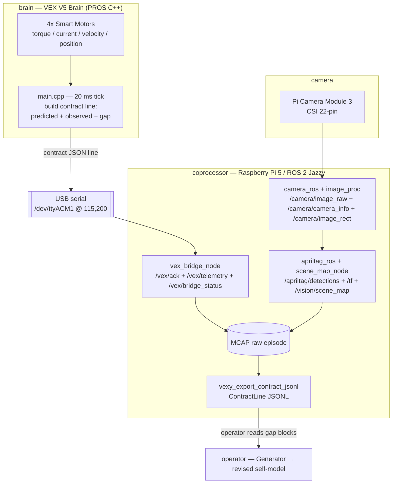
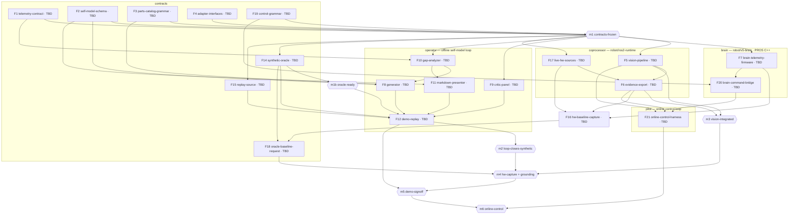

# LLM Self-Modeled Robot

| Field | Value |
|---|---|
| Driver | [wiki/knowledge/concepts/llm-authored-self-model.md](wiki/knowledge/concepts/llm-authored-self-model.md) |
| Team | David Taylor · Jake Kinchen · Grace Huang · Erick Andrade |
| Build budget | **4 days** (2026-06-20 → 2026-06-24); integration/demo hardening 2026-06-25 → 2026-06-29 |
| Demo | **2026-06-29** |
| Runtime | Claude Code subscription (interactive) + scripted replay |

> **Authority.** The three frozen contracts (under Constraints) are *specified* here for freeze but their canonical machine copies live in the `contracts/` vertical — code owns the runtime source of truth, this document owns the requirement. **The SDD orchestration is folded into this file:** *Tech stacks* is the Stack Registry, *Components* + *Sub-features* are the Feature Catalog, and *Sequencing* is the human-visible Dependency Graph.

---

## Context

**What this is.** A **generational self-model loop** that runs on real hardware: an LLM authors a structured, human-readable self-model of a VEX-V5 robot from a finite typed parts vocabulary; a panel of adversarial critic agents attacks it before assembly; the robot (or its recorded/synthetic stand-in) executes tasks; per-actuator telemetry and camera vision produce signed **gap** residuals; the LLM revises its own self-model; the next generation is built. The self-model is a versioned JSON document with a first-class `reasoning` field, so every generation stays human-inspectable.

**Who it's for.** The target user is a robotics/ML engineer who hand-tunes robot models today; the job-to-be-done is *"let my robot revise its own model from reality without me hand-tuning firmware."* The ICP / evaluator is the Gauntlet reviewer.

**The problem.** Every robot carries an internal self-model — parts, reach, force, timing — that is subtly wrong (real friction runs higher than spec, the arm assembles a few mm short, wheels slip). Engineers fix this by hand; the robot cannot revise its own model. Academic work covers *numerical* self-models (Lipson 2006–2019, opaque tensors a human cannot read) and *LLM design in simulation* (RoboMorph 2024, no hardware, no telemetry). No published system combines a **language-authored self-model** humans can read and edit, **adversarial multi-LLM critique before assembly**, and **per-actuator telemetry feedback** closing the loop on reality. That intersection is empty.

**Showcase thesis.** The primary ability demonstrated is closing a *full* multi-modal loop — telemetry + vision → LLM reasoning → physical redesign — that most capstones only partially touch. The memorable 5-minute moment is the robot's *self-knowledge improving in readable prose* while the predicted→observed **gap collapses** across generations.

### Pre-Search Checklist (challenge-specific)

- **Phase 1 · Contract** — Required: working generational loop + June 29 live demo + readable self-model audit trail. Fails-even-if-code-is-good: no *gap-tightening* shown; demo with no recorded fallback. Avoid: autonomous-assembly scope creep; LiPo safety mishandling.
- **Phase 2 · Thesis** — Demonstrate a fully closed multi-modal loop; memorable moment = self-knowledge improving in prose + live gap collapse.
- **Phase 3 · Product** — User: robotics/ML engineer; JTBD: self-revising model without hand-tuning; smallest proof: one grab primitive improving across rounds.
- **Phase 4 · System shape** — Verticals: contracts · operator · coprocessor · brain. Freeze first: the three contracts (Constraints → Frozen Contracts).
- **Phase 5 · Integration** — High-risk: live VEX+Pi+camera, on-device YOLO, live Claude in demo. Mockable behind one adapter: telemetry + vision sources. Swap path documented in Constraints.
- **Phase 6 · MVP cut** — Software loop on frozen contracts; V1 motor+vision over recorded/synthetic; V1.5 live hardware; V2 Gen-3. Fallback: recorded JSONL replay if live robot fails mid-demo.
- **Phase 7 · Verification** — Test gap math, revision-consumes-residuals, critic catches a planted torque error. Reviewer runs `make demo`. Proof: video, gap-JSON screenshots, self-model diffs.
- **Phase 8 · Execution** — Parallel after contract freeze; first-unblock = `contracts`; drift prevented by schemas living only in `contracts`.

---

## Goal

By the demo, the system closes the generational self-model loop **in software** across the offline-loop verticals (`contracts`, `operator`, `coprocessor`, `brain`) — `brain` emits the telemetry contract, `coprocessor` merges telemetry + vision into `session_*.jsonl` through swap-in adapters, `operator` runs the Generator + Critic panel + gap analysis to revise the self-model, and `contracts` holds the frozen schemas every vertical imports — demonstrating **monotonically tightening gap residuals across ≥2 generations (Gen 0 → Gen 2)** for the grab primitive, with Gen 0/1 recorded and Gen 2 run live; the same architecture **expands to the full physical loop by replacing an adapter implementation only**, with no contract change.

**Scope cut**
- **MVP (V1) — required:** frozen contracts with validating models + fixtures; Generator authoring Gen 0 and revising Gen 1/Gen 2 from gap residuals; 3-critic panel; telemetry pipeline on a `TelemetrySource` adapter (Replay + Synthetic implemented); vision pipeline (YOLO11n + AprilTag) behind a `VisionSource` adapter merged into the JSONL `vision` block; gap analyzer + `make demo` deterministic replay; markdown/terminal presenter.
- **V1.5 — integration window (post-4-day):** ROS 2 Jazzy on the Pi 5 is the active live runtime: `camera_ros` publishes PiCam2 frames and measured `CameraInfo`, `image_proc` rectifies frames, `apriltag_ros` publishes detections/TF, `scene_map_node` publishes `/vision/scene_map`, and `vex_bridge_node` demultiplexes V5 ack/telemetry/faults. Raw hardware episodes are captured as MCAP and exported to contract-valid JSONL; `robot/pi-runtime/` remains a fallback, not the preferred live path.
- **V2 — stretch (deadline-safe only):** live Gen-3 revision on-stage; RS-485 Smart-Port transport.
- **OUT of scope:** autonomous robotic assembly; Booster Kit / extra cartridges / custom 3D-printed end-effectors as MVP; scripted Anthropic API runtime; any web UI; a physics simulation engine.

---

## Tech stacks

*(Stack Registry — every component/feature belongs to exactly one vertical. `ignore_folders` are captured so `/prepare-sdd-slice <feature_slug>` can generate valid `requirements.md` front matter.)*

**Shared tooling (non-negotiable, all Python verticals).** Python dependencies and virtualenvs are managed with **`uv`** (`uv sync` / `uv add` / `uv run`); linting and formatting use **`ruff`** (`ruff check` / `ruff format`). No `pip`, `poetry`, `pip-tools`, `black`, `isort`, or `flake8`. The `brain` vertical is **PROS C++** (not Python): it compiles with the PROS CLI + the `arm-none-eabi` toolchain, and `uv` manages only its dev tooling (the `pros-cli`, pinned in `robot/v5-brain/`). See *Verification & Reviewer Runbook → Brain (PROS C++)*.

**Hardware-access split .** Erick is the only member with no robot access and works entirely off the hardware (system design, contracts, synthetic oracle). The software telemetry sources (`Synthetic` oracle, `Replay` reader) live in the `contracts` vertical so they stay off the hardware critical path. Per-feature owners are **TBD** (see *Sub-features*), with the exception of Erick's contracts + oracle work.

- `contracts` — Python 3.12 · uv · ruff · pydantic v2 · **reactivex** · dev-machine · the cross-vertical source of truth + adapter interfaces + the **control grammar** + the `Synthetic` oracle and `Replay` sources.
  - root: `contracts/` · ignore_folders: `.venv`, `__pycache__`, `dist`, `.pytest_cache`, `captures` · 
- `operator` — Python 3.12 · uv · ruff · Claude Code skills (Generator + Critic) · dev-machine · the **offline self-model loop** (authoring/critique/replay/presentation).
  - root: `operator/` · ignore_folders: `.venv`, `__pycache__`, `.claude`, `out`, `.pytest_cache` · Owner: **TBD**
- `pilot` — Python 3.11 · uv · ruff · Raspberry Pi 5 · the **online control loop**: an on-Pi LLM that reads live telemetry + vision and issues fixed control-grammar commands in real time. *(name provisional; ADR-19)*
  - root: `pilot/` · ignore_folders: `.venv`, `__pycache__`, `captures` · Owner: **TBD**
- `coprocessor` — Python 3.11 · uv · ruff · Raspberry Pi 5 · Ubuntu 24.04 + ROS 2 Jazzy · `camera_ros` + measured `CameraInfo` + `image_proc` + `apriltag_ros` + `scene_map_node` + V5 serial bridge + MCAP capture + contract JSONL export. `robot/pi-runtime/` is retained as a legacy/fallback runtime.
  - root: `robot/ros2-runtime/` · legacy_fallback_root: `robot/pi-runtime/` · ignore_folders: `.venv`, `__pycache__`, `build`, `install`, `log`, `models`, `captures`, `proof` · Owner: **TBD**
- `brain` — **PROS C++** (FreeRTOS) · PROS CLI + `arm-none-eabi` · `uv`-managed `pros-cli` (dev only) · V5 Brain · emits the telemetry contract + executes clamped control commands.
  - root: `robot/v5-brain/` · ignore_folders: PROS `bin/` (per the project's own `.gitignore`) · Owner: **TBD**

---

## Components

*(Each component, its `(vertical)`, and what it owns. Boundary rule: no schema is defined outside `contracts`; the MVP depends only on adapter interfaces in `contracts`, never on a concrete provider.)*

- **Telemetry contract** `(contracts)` — owns the `predicted`/`observed`/`gap`/`vision` JSON line shape (see Constraints → Frozen Contracts).
- **Self-model schema** `(contracts)` — owns the versioned 4-layer + `reasoning` self-model document shape.
- **Control grammar** `(contracts)` — owns `control-command`: the fixed command vocabulary + command/ack envelope the online loop uses to drive the robot (frozen at m1; ADR-19). *(215eight)*
- **Parts catalog grammar** `(contracts)` — owns `parts_catalog.json`, the finite typed design vocabulary (60 valid configs under F3's valid-config rules). *(TBD)*
- **Adapter interfaces** `(contracts)` — owns `TelemetrySource` and `VisionSource` `@runtime_checkable` Protocol definitions; each exposes a single `observe()` method returning a `reactivex.Observable` stream (`Observable[ContractLine]` and `Observable[VisionBlock]` respectively). Cold observables for `Replay`/`Synthetic` sources; hot observables (bridged via `Subject`) for `Serial`/`Camera` sources. Decouples every consumer from hardware; swapping an implementation is a config flag with no pipeline change (ADR-20). *(TBD)*
- **Synthetic oracle** `(contracts)` — owns `SyntheticTelemetrySource`: a parametric hidden-ground-truth forward model (friction, effective arm length, torque constant, mass) + measured noise; the LLM-information-separation rule applies (Constraints → Oracle grounding).
- **Replay source** `(contracts)` — owns `ReplayTelemetrySource` / `ReplayVisionSource`: deterministic file readers over recorded `session_*.jsonl`. *(TBD)*
- **Live hardware sources** `(coprocessor)` — owns the ROS live sources that back the adapter boundary: `/camera/image_raw`, `/camera/camera_info`, `/camera/image_rect`, `/apriltag/detections`, `/tf`, `/vision/scene_map`, `/vex/ack`, `/vex/telemetry`, and `/vex/bridge_status`. *(TBD)*
- **Vision pipeline** `(coprocessor)` — owns the PiCam2 ROS path: `camera_ros` + measured calibration YAML loaded through `camera_info_url`, `image_proc` rectification, `apriltag_ros`, `scene_map_node`, and later YOLO11n object indications → `VisionBlock`. *(TBD)*
- **Serial bridge / merge** `(coprocessor)` — owns `vex_bridge_node` ack/telemetry/fault demux, raw MCAP episode recording, and `vexy_export_contract_jsonl` export into existing `contracts.ContractLine` JSONL. *(TBD)*
- **Baseline capture** `(coprocessor)` — owns the one-off real grab/pull capture run that grounds the oracle; delivers recorded JSONL to Erick. *(TBD)*
- **Brain telemetry firmware** `(brain)` — owns the PROS C++ program (`robot/v5-brain/`) that reads the motor API and emits contract JSON lines on a 20 ms tick; motor wiring, port assignments, bumper config. *(TBD)*
- **Brain command bridge** `(brain)` — owns the bidirectional PROS C++ path: receive clamped control-grammar commands, ack, watchdog-stop, and fixed bounded routine slots (`2` 720 spin, `3` arm up/down, `4` one-foot forward/back). *(TBD)*
- **Generator** `(operator)` — owns the Claude Code workflow/prompts that author and revise the self-model from gap residuals. *(TBD)*
- **Critic panel** `(operator)` — owns three stateless pre-build critics (physics validity · torque budget · CoM/geometry) returning pass/flag + rationale. *(TBD)*
- **Gap analyzer** `(operator)` — owns residual computation and the deterministic replay harness. *(TBD)*
- **Markdown presenter** `(operator)` — owns gap tables, self-model diffs, and the `reasoning` audit-trail render. *(TBD)*
- **Demo replay** `(operator)` — owns `make demo`, the end-to-end deterministic Gen 0 → Gen 2 reproduction. *(TBD)*
- **Online-control harness** `(pilot)` — owns the on-Pi real-time loop: read live telemetry + vision → LLM picks a control-grammar command → send → ack → repeat, bounded + interruptible (ADR-19). *(TBD)*
### Telemetry capture & merge (data flow)

Two independent sources are captured on the Pi: the VEX **motor telemetry/ack/fault** stream over USB serial and the **camera vision** stream over CSI. In the live path, ROS 2 topics are the raw evidence surface and `ros2 bag`/MCAP is the replayable episode store. The semantic handoff to the self-model loop remains contract-valid JSONL exported through `contracts.ContractLine`; no second schema is defined under `robot/ros2-runtime`.



The exported record is exactly the Task Telemetry Contract (Constraints -> Frozen Contracts): Brain telemetry supplies motor/ack evidence, and the vision stack supplies the `vision` block (`object_bbox`, `apriltag_pose`, `bbox_iou` as available). On hardware the adapters resolve through ROS live topics and MCAP replay; for the MVP and the reviewer's `make demo` they resolve to `Replay` / `Synthetic` so the downstream self-model loop is unchanged.

---

## Sub-features

*(Feature Catalog — a single ordered list of tasks, sequenced by **cohesive unit of work** (not by owner). `F#` is the stable task id; `Deps` are prerequisite tasks; **Owner** is `TBD` except Erick's contracts + oracle work.)*

| # | Task | Vertical | Deps | MVP | Owner |
|---|------|----------|------|-----|-------|
| 1 | `F1` telemetry-contract — freeze the predicted/observed/gap/vision JSON line | contracts | — | ✅ | TBD|
| 2 | `F2` self-model-schema — freeze the versioned 4-layer + reasoning self-model | contracts | — | ✅ | TBD|
| 3 | `F3` parts-catalog-grammar — freeze `parts_catalog.json` vocabulary + valid-config rules | contracts | — | ✅ | TBD |
| 4 | `F4` adapter-interfaces — `TelemetrySource`/`VisionSource` protocols | contracts | F1 | ✅ | TBD |
| 5 | `F19` control-grammar — freeze the `control-command` vocabulary + command/ack (frozen at m1) | contracts | F1 | ✅ | 215eight |
| 6 | `F14` synthetic-oracle — hidden-ground-truth `SyntheticTelemetrySource` | contracts | F1, F4 | ✅ | Erick |
| 7 | `F15` replay-source — `Replay` telemetry/vision readers over recorded sessions | contracts | F1, F4 | ✅ | TBD |
| 8 | `F10` gap-analyzer — compute signed residuals from contract lines | operator | F1 | ✅ | TBD |
| 9 | `F9` critic-panel — 3 stateless pre-build critics, pass/flag + rationale | operator | F2 | ✅ | TBD |
| 10 | `F8` generator — author Gen 0; revise Gen N+1 from gap residuals | operator | F2, F3, F10 | ✅ | TBD |
| 11 | `F11` markdown-presenter — gap tables + self-model diff + reasoning | operator | F2, F10 | ✅ | TBD |
| 12 | `F12` demo-replay — `make demo` deterministic Gen 0 → Gen 2 | operator | F8, F9, F10, F11, F14, F15 | ✅ | TBD |
| 13 | `F5` vision-pipeline — PiCam2 rectification + AprilTag scene map + YOLO11n/color indications + no-motion task plans → vision block | coprocessor | F4 | ✅ | TBD |
| 14 | `F6` evidence-export — MCAP/raw ROS evidence + telemetry/vision → contract JSONL | coprocessor | F4, F5 | ✅ | TBD |
| 15 | `F7` brain-telemetry-firmware — PROS C++ emits the contract on a 20 ms tick | brain | F1 | ✅ (V1.5 live) | TBD |
| 16 | `F17` live-hw-sources — ROS-backed V5 telemetry/ack + PiCam2/AprilTag scene map | coprocessor | F4 | ✅ (V1.5) | TBD |
| 17 | `F16` hw-baseline-capture — capture one real baseline; deliver JSONL to Erick | coprocessor + brain | F7, F6, F17 | ✅ (V1.5) | TBD |
| 18 | `F18` oracle-baseline-request — spec capture format; recalibrate the oracle | contracts | F14, F16 | ✅ | TBD |
| 19 | `F20` brain-command-bridge — bidirectional PROS C++ (receive cmd + ack + watchdog) | brain | F19, F7 | ✅ (online) | TBD |
| 20 | `F21` online-control-harness — on-Pi LLM real-time control loop | pilot | F19, F20, F5, F6 | ✅ (online) | TBD |
---

## Milestones

*(Sequential validation gates. Each milestone states its goal and gates the work that follows.)*

1. **`m1` contracts-frozen** *(manual — human gate)* — **Goal:** every contract loads and round-trips — pydantic models + example fixtures for the telemetry, self-model, parts-catalog, and control-command schemas parse cleanly. Gates all downstream work. **Signed off 2026-06-24 (215eight).**
2. **`m1b` oracle-ready** *(manual — human gate)* — **Goal:** the parametric `SyntheticTelemetrySource` emits contract-valid synthetic telemetry with its hidden parameters separated from the Generator (datasheet-grounded until baseline data lands). Gates m2.
3. **`m2` loop-closes-synthetic** *(manual — human gate)* — **Goal:** `make demo` runs the offline loop over synthetic JSONL — Generator authors Gen 0, the critic panel returns pass/flag, and gap residuals tighten Gen 0 → Gen 2 (the oracle's hidden parameter recovered within tolerance). Gates hardware integration. **Owner: TBD.**
4. **`m3` vision-integrated** *(manual — human gate)* — **Goal:** PiCam2 measured `CameraInfo` is loaded, `/camera/image_rect` is live, AprilTag detections/TF produce `/vision/scene_map`, no-motion object task plans plus bounded survey task plans can be captured, and the resulting vision evidence can be exported into a valid `vision` block. Gates m4. **Owner: TBD.**
5. **`m4` hardware-capture + grounding** *(manual)* — **Goal:** a real V5 + Pi baseline capture (F16) is delivered as replayable MCAP plus contract-valid JSONL with Brain ack/telemetry, vision/scene-map evidence, and bounded motion proof (tag alignment and scan-only survey), so the oracle can be recalibrated (F18) and replay stays green. Gates m5. **Owner: TBD** (capture) -> (calibrate).
6. **`m5` demo-signoff** *(manual)* — **Goal:** Gen 0/1 recorded + Gen 2 live rehearsed end-to-end, with a recorded fallback ready.
7. **`m6` online-control** *(manual; stretch — ADR-19)* — **Goal:** the `pilot` harness drives an open-ended task in real time on hardware (reading live telemetry + vision, issuing control-grammar commands), bounded by iteration/time limits with a working human interrupt. **Owner: TBD.**

---

## Sequencing

*(The visual dependency graph: features → milestone gates → features, grouped by vertical. Owners shown inline — `TBD` where unassigned.)*



### Critical Path

The minimum-duration chain to the **grounded** demo runs through hardware capture, not the software loop — the software loop reaches `m2` early and de-risks the demo.

1. `F1` telemetry-contract (TBD) → `m1` contracts-frozen (TBD)
2. `F5` vision-pipeline ∥ `F7` brain-telemetry-firmware ∥ `F17` live-hw-sources *(TBD)*
3. `F6` evidence-export *(TBD; needs F5 + F17)* → `m3` vision-integrated *(TBD)*
4. `F16` hw-baseline-capture *(TBD; needs F7 + F6 + F17)*
5. `F18` oracle recalibration (needs F16) → `m4` hw-capture + grounding
6. `m5` demo-signoff (TBD)

The online control loop (`F19` → `F20` → `F21` → `m6`) extends the chain past the demo and is a stretch goal (ADR-19).

**Critical-path risk.** The brain telemetry firmware (`F7`) and the vision pipeline (`F5`) both feed the hardware capture on the critical path. If one owner ends up holding both, split them so the two path items run in parallel rather than serially (tracked in Open questions O4).

**Phasing.** Freeze the contracts + grammar (`m1`); build the synthetic oracle + replay and the offline operator loop to close `m2`; bring up calibrated vision + scene-map export for `m3`; capture a real MCAP/JSONL baseline and re-ground the oracle for `m4`; rehearse the demo for `m5`. The online control loop (`m6`) follows once the command path is proven on hardware.

---

## Constraints

*(Shared non-negotiables and cross-vertical contracts.)*

### Frozen Contracts (contract-first — frozen at m1; canonical copies live in `contracts/`)

**Task Telemetry Contract** — one line per task in `session_*.jsonl` (`task ∈ {grab, pull, throw}`; `vision` fields present-but-optional so a motor-only run still validates; the `gap` block is the only signal the Generator needs):
```json
{
  "schema_version": "1.0",
  "session_id": "session_20260624_141200",
  "generation": 0,
  "round": 1,
  "task": "grab",
  "predicted": { "grip_force_N": 14.7, "duration_s": 1.2, "success": true },
  "observed":  { "torque_Nm": 0.9, "current_A": 1.8, "velocity_RPM": 2.3, "position_deg": 95.0, "duration_s": 1.4 },
  "gap":       { "force_error_N": -3.4, "duration_error_s": 0.2 },
  "vision":    { "object_detected": true, "object_bbox": [310, 220, 64, 58], "apriltag_pose": { "x": 487, "y": -12, "heading": 2 }, "bbox_iou": 0.71 }
}
```

**Self-Model Schema** — versioned JSON, one document per generation:
```json
{
  "schema_version": "1.0",
  "generation": 0,
  "parent_generation": null,
  "config": { "motor_allocation": "2drive+1arm+1claw", "end_effector": "claw_grasper", "cartridge": "200rpm" },
  "structural":  { "parts": [], "connections": [] },
  "capability":  { "reach_mm": 0, "max_grip_force_N": 0, "max_pull_force_N": 0, "com_height_mm": 0 },
  "predictive":  { "grab": {}, "pull": {}, "throw": {} },
  "gap_model":   { "grab": {}, "pull": {}, "throw": {} },
  "reasoning":   { "end_effector": "claw_grasper chosen to grasp game objects", "cartridge": "200rpm balances drivetrain speed and torque" }
}
```

**Parts Catalog Grammar** — `parts_catalog.json` (Starter Kit). Narrowed 2026-06-24 (PR #16 post-merge review) to what the V5 Starter Kit can actually build:

- `motor_allocation` is now **effector-encoded** — each value names a concrete build (the claw, scoop, or flywheel variant) rather than an abstract motor budget. `4drive`, `2drive+2free`, and `3drive+1manip` are gone.
- `arm_position` (fixed to rear — moving it is infeasible), `arm_gear_ratio` (fixed at 7:1 mechanical — the configurable knob is the cartridge), and `wheel_config` (already single-valued) are no longer config axes.
- `cartridge` drops `100rpm` (not in inventory).

The buildable design space is **4 configs** under F3's rules — claw (1) + scoop (2) + flywheel (1); enforced by F3's enumeration test. The rule set is: R1 `CLAW_MOTOR_BUDGET` (claw ⇒ `2drive+1arm+1claw`), R1b `SCOOP_ALLOCATION` (scoop ⇒ `2drive+1arm`), R1c `FLYWHEEL_ALLOCATION` (flywheel ⇒ `2drive+1flywheel`), R3 `FLYWHEEL_CARTRIDGE` (flywheel ⇒ `600rpm`), R4 `CLAW_CARTRIDGE` (claw ⇒ `200rpm`).

```json
{
  "motor_allocation": ["2drive+1arm+1claw", "2drive+1arm", "2drive+1flywheel"],
  "end_effector":     ["claw_grasper", "scoop", "flywheel"],
  "cartridge":        ["200rpm", "600rpm"]
}
```

> The `reasoning` field is a **`dict[str, str]`** — one keyed rationale per structural choice (Gen 0) or per changed parameter (each revision); see the canonical pydantic copy in `contracts/`.

### Closed Decisions (ADR / trade-off log)

Closed decisions use definitive language — no "if needed / or / prefer / may be."

> **Additions 2026-06-21.** New research + hands-on bringup add to the decisions above:
>
> - **Vertical roots.** `coprocessor` → `robot/ros2-runtime/` for the active Ubuntu/Jazzy
>   deployment; `robot/pi-runtime/` remains the legacy/fallback surface. `brain` → `robot/v5-brain/`
>   (DEC-0001 deployable surface); `contracts/`, `operator/`, `pilot/` are repo-root dirs.
> - **ADR-19 (new) — online real-time control loop is first-class.** Beyond the offline generational
>   self-model loop, the project includes a second loop: an online LLM on the Pi (`pilot` vertical)
>   reads live telemetry + vision and issues **fixed control-grammar** commands to perform an
>   open-ended task in real time, bounded by iteration/time limits + a human interrupt, informed by
>   the offline analysis. Adds a `control-command` contract (frozen at m1) owned by `contracts`. **Revisit
>   ADR-03/ADR-08:** on-device online inference likely needs an API key + network (contradicting "no
>   keys"); the runtime + secret posture for `pilot` is an open decision. Rejected: leaving real-time
>   control as V2-only (the maintainer scoped it in now).

| # | Decision | Chosen | Rationale | Rejected |
|---|---|---|---|---|
| ADR-01 | HW strategy | **Software-first loop behind `TelemetrySource`/`VisionSource` adapters** | Guarantees a demoable loop; expands to full physical loop by swapping adapter implementation only | Full-physical-as-MVP (deadline-gated on wiring); pure-simulation (weakens thesis) |
| ADR-02 | Vision | **In MVP, source-abstracted** | Honors the multi-modal claim; recorded/synthetic frames keep it off the hardware critical path | Defer vision; AprilTag-only |
| ADR-03 | Reviewer reproduction | **Claude Code interactive + scripted `make demo` replay** | Reviewer reproduces gap analysis over recorded JSONL without robot or subscription | Claude-Code-only (not reproducible); scripted API harness (reopens ADR-08) |
| ADR-04 | Presentation | **Markdown/terminal renderer** | Zero UI build cost; carries the narrative through diffs + tables | Web dashboard; raw-JSON-only |
| ADR-05 | Language | **Python on `contracts`/`operator`/`coprocessor`/`pilot`; PROS C++ on `brain`** | One Python toolchain for the dev/Pi verticals; the Brain needs C++ for real-time + bidirectional serial (MicroPython too slow for tight loops; serial-receive on the Brain unconfirmed) | Python on the Brain |
| ADR-06 | Contract validation | **pydantic v2 models, JSON-Schema export** | Single definition validates and documents the contract | Hand-rolled validation |
| ADR-07 | Critic count | **3 critics: physics · torque · CoM/geometry** | Matches the failure modes a pre-build review must catch | Single critic; >3 |
| ADR-08 | LLM runtime | Claude Code subscription *(inherited, PLAN §7)* | Reads files directly; no key/billing/latency infra | Scripted API |
| ADR-09 | Coprocessor | Raspberry Pi 5 *(inherited)* | 3× CPU; USB-C power | Jetson Nano (EOL); Orin ($430+) |
| ADR-10 | Transport | USB serial 115,200 baud *(inherited)* | No extra hardware; RS-485 is a Stage-2 upgrade path | RS-485 now |
| ADR-11 | Storage | **MCAP raw evidence + contract JSONL semantic export** | MCAP preserves replayable ROS topics; JSONL remains the frozen self-model contract handoff | SQLite; CSV; raw ROS messages as the only LLM input |
| ADR-12 | Assembly | Human-in-the-loop *(inherited)* | Full autonomy infeasible at capstone scale | Autonomous assembly |
| ADR-13 | Localization | **AprilTags through measured CameraInfo + rectification + scene map** | Wheel slip defeats odometry; `apriltag_ros` consumes calibrated `/camera/image_rect` and `/camera/camera_info`, while `/vision/scene_map` expresses wiki map coordinates | Pure odometry; uncalibrated tags; RealSense |
| ADR-14 | Design space | Starter Kit only *(inherited)* | ~10–15 configs, exhaustible in 3–5 gens | Booster Kit as MVP |
| ADR-15 | Python deps | **uv** (`uv sync` / `uv add` / `uv run`) | Fast, lockfile-reproducible; one tool for envs + deps | pip; poetry; pip-tools; conda |
| ADR-16 | Lint / format | **ruff** (`ruff check` / `ruff format`) | Single fast tool replaces flake8 + black + isort | black; isort; flake8; pylint |
| ADR-17 | Synthetic telemetry | **Parametric hidden-ground-truth oracle** (closed-form forward model + measured noise) as `SyntheticTelemetrySource` | Honest gap — the LLM recovers hidden parameters it never sees; cheap; not a physics engine | Hand-authored `observed` values (rigged); robot/physics simulator (out of scope) |
| ADR-18 | Hardware access & ownership | **Erick is off-hardware (contracts + oracle); all other vertical/feature owners are TBD** | Erick has no robot access; the rest of the split is deferred until the team confirms it | Erick on hardware |
| ADR-19 | Online control loop | **First-class: an on-Pi LLM (`pilot`) issues fixed control-grammar commands in real time** | Adds the autonomous online loop alongside the offline self-model loop | Real-time control left V2-only |
| ADR-20 | Adapter pipeline model | **`reactivex` Observable streams at the adapter boundary** — `TelemetrySource.observe() -> Observable[ContractLine]`; `VisionSource.observe() -> Observable[VisionBlock]`; ROS live topics and MCAP replay feed the same contract adapters; the `pilot` real-time loop uses `flat_map` / `take_until` | The whole pipeline is inherently reactive: motors push hot ticks, camera pushes hot frames, the bridge/export path buffers and normalizes evidence, and the online control loop is a real-time reactive fan-out. `buffer`, `flat_map`, and `take_until` are first-class primitives, not one-offs to hand-implement. Cold/hot split (D5 in F4 brief): `Replay`/`Synthetic` are cold; ROS live topics are hot via Subject | Discrete `read()`/`state()` per call — would require reimplementing buffering and cancellation by hand across export, gap-analyzer, and pilot |

### Integration Boundaries & Swap Paths

Every shortcut sits behind a protocol/adapter boundary in `contracts` and has a documented production replacement. Replacing a shortcut is an implementation swap, not a redesign.

| Boundary (interface in `contracts`) | MVP implementation (shortcut) | Production replacement (swap path) |
|---|---|---|
| `TelemetrySource.observe() -> Observable[ContractLine]` | `ReplayTelemetrySource` (cold Observable over recorded JSONL, `on_completed` at EOF) · `SyntheticTelemetrySource` (cold Observable) | ROS-backed `vex_bridge_node` evidence from `/vex/ack`, `/vex/telemetry`, and `/vex/bridge_status`, exported from MCAP into `ContractLine`; direct serial adapter remains a fallback |
| `VisionSource.observe() -> Observable[VisionBlock]` | `ReplayVisionSource` (cold Observable over recorded frames/state) · `SyntheticVisionSource` (cold Observable) | ROS-backed PiCam2 path from `/camera/image_rect`, `/apriltag/detections`, `/tf`, and `/vision/scene_map`; YOLO11n object indications join on `/vision/object_indications` |
| Operator host | Single dev machine | On-Pi / two-machine deployment |
| Transport | USB serial | RS-485 Smart Port (Stage 2) — same JSON, different baud |
| `LLMRuntime` | Claude Code interactive (authoring) + cached transcripts for replay | Same runtime; replay reapplies recorded revisions deterministically |

### Oracle grounding & information separation (simulation-first honesty)

- The `SyntheticTelemetrySource` is a **parametric hidden-ground-truth oracle** (ADR-17): a closed-form forward model with a few physical parameters (friction coefficient, effective arm length, torque constant, mass) plus measured noise. It is **not** hand-authored numbers and **not** a physics simulator.
- **Information separation (non-negotiable):** the oracle's true parameters are **hidden from the Generator**. The Generator (F8) reads only `parts_catalog.json` + prior gap residuals; it never reads the oracle config. Gap-tightening must come from the self-model converging on the hidden truth, not from steering. This is what makes the synthetic demo a real test rather than a puppet show.
- **Grounding requires hardware data Erick cannot collect himself.** The oracle's noise/offset parameters are calibrated from at least one real baseline capture (**F16**, owner TBD per O1; depends on the brain telemetry firmware F7) and requested via **F18**. Until that capture lands, the oracle runs **datasheet-grounded** (V5 11W Smart Motor: stall 2.1 Nm, continuous 0.735 Nm; `torque()`/`current()`/`velocity()`/`position()` API) and the m2 demo is **labeled "ungrounded synthetic."** Re-grounding closes at m4.

### Verification & Reviewer Runbook

A reviewer runs:
```bash
uv sync              # install pinned dependencies per vertical (no pip)
make demo            # deterministic Gen 0 → Gen 2 replay over recorded session JSONL (runs via `uv run`)
make test            # unit tests: gap math, revision-consumes-residuals, critic flags planted torque error
make validate        # pydantic validation of all fixtures against the frozen schemas
make lint            # ruff check + ruff format --check across all verticals
```
A reviewer inspects: the printed gap tables (residuals shrinking across generations), the self-model JSON diff per generation, and the `reasoning` audit trail. Risky behavior is proven by a test that plants a torque-budget violation and asserts the critic panel flags it pre-build, and a test asserting a revised self-model's predicted value moves toward the observed value after consuming a gap block. **Completion is verified when** `make demo` shows monotonically tightening gap residuals across ≥2 generations, `make test` and `make validate` pass, and m1–m5 are green.

**Brain (PROS C++) — separate from the Python `make` path.** The `brain` vertical is firmware, not reached by `uv`/`make`. Build it from `robot/v5-brain/`:
```bash
uv sync                          # installs the pinned pros-cli (dev tooling only)
pros make clean && pros make     # monolith build (USE_PACKAGE:=0) -> bin/monolith.bin
pros upload --after run          # flash a connected V5 over USB
```
Compilation uses the `arm-none-eabi` cross-toolchain; PROS kernel/templates are managed via `project.pros` (`pros conductor`). See `robot/v5-brain/TOOLCHAIN.md`. **Verification** for the Brain is *compile-clean + valid telemetry on the user port* — there is no on-Brain unit-test framework, and a C++ formatter (`clang-format`) is not yet established (open gap). The reviewer's `make demo` runs on `Replay`/`Synthetic` and does **not** require the Brain to build.

### Success Metrics

- Gap residual magnitude **decreases** across ≥2 generations for the grab primitive (primary).
- Self-model is human-readable and its `reasoning` diff is auditable generation-to-generation.
- A reviewer reproduces the loop with one command — no robot, no subscription.
- Live Gen-2 prediction-vs-observed lands on the demo surface with a recorded fallback ready.

### Risks & Limitations

- **R1** live Claude Code in demo → mitigated by recorded fallback.
- **R2** on-device YOLO setup overrun → vision is source-abstracted; demo uses recorded frames if live fails.
- **R3** hardware slips past Day 4 → MVP never depends on it (ADR-01).
- **Limitation** gap residuals come from telemetry, not simulation; no physics sim independently validates predictions. A single kit bounds the design space to ~10–15 configs.

---

## Open questions

- **O1** Owner assignment is **TBD** for every vertical/feature. Confirm the per-vertical and per-feature owners; the earlier even-split proposal is withdrawn pending that decision.
- **O2** *(resolving)* "Gap tightened" = the Generator's estimate of the oracle's hidden parameter (e.g., friction coefficient) is recovered within a tolerance band — target **≤10%** — across ≥2 generations, with the true value revealed only at the end. Finalize the band at m1b once the oracle is calibrated.
- **O3** Whether the **grounded** re-run (after F18 recalibration) completes before m5, or the demo presents ungrounded-synthetic results plus the m4 baseline capture as corroboration.
- **O4** *(critical-path risk)* The brain telemetry firmware (F7) and the vision pipeline (F5) both feed the hardware capture on the critical path. When owners are assigned (O1), keep F5 and F7 on different people so the two path items run in parallel rather than serially.
