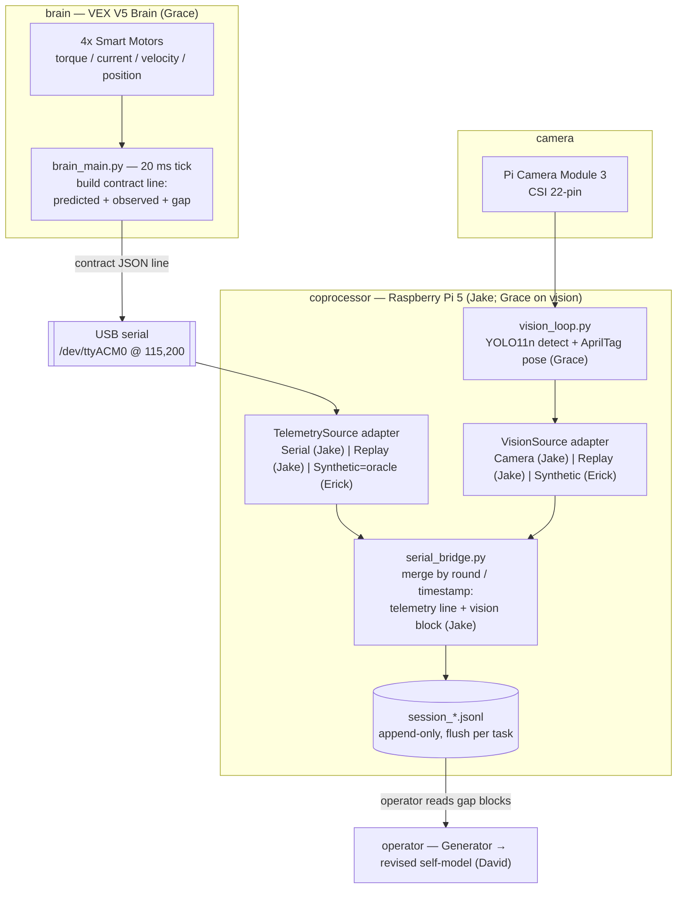
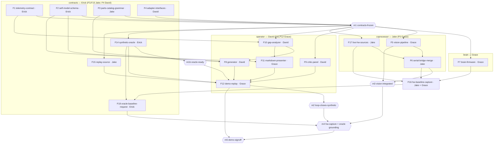

# LLM Self-Modeled Robot

| Field | Value |
|---|---|
| Driver | [wiki/knowledge/concepts/llm-authored-self-model.md](wiki/knowledge/concepts/llm-authored-self-model.md) |
| Team | David Taylor · Jake Kinchen · Grace Huang · Erick Andrade |
| Build budget | **4 days** (2026-06-20 → 2026-06-24); integration/demo hardening 2026-06-25 → 2026-06-29 |
| Demo | **2026-06-29** |
| Runtime | Claude Code subscription (interactive) + scripted replay |

> **Authority.** This document is the decision-closed, authoritative source for what must be built, what is out of scope, and what verifies completion. [PLAN.md](PLAN.md) and [ARCHITECTURE.md](ARCHITECTURE.md) remain narrative/design background; where they disagree with this file, **this file wins**. The three frozen contracts (under Constraints) are *specified* here for freeze but their canonical machine copies live in the `contracts/` vertical — code owns the runtime source of truth, this document owns the requirement. **The SDD orchestration is folded into this file:** *Tech stacks* is the Stack Registry, *Components* + *Sub-features* are the Feature Catalog, and *Sequencing* is the human-visible Dependency Graph.

---

## Context

**What this is.** A **generational self-model loop** that runs on real hardware: an LLM authors a structured, human-readable self-model of a VEX-V5 robot from a finite typed parts vocabulary; a panel of adversarial critic agents attacks it before assembly; the robot (or its recorded/synthetic stand-in) executes tasks; per-actuator telemetry and camera vision produce signed **gap** residuals; the LLM revises its own self-model; the next generation is built. The self-model is a versioned JSON document with a first-class `reasoning` field, so every generation stays human-inspectable.

**Who it's for.** The target user is a robotics/ML engineer who hand-tunes robot models today; the job-to-be-done is *"let my robot revise its own model from reality without me hand-tuning firmware."* The ICP / evaluator is the Gauntlet reviewer.

**The problem.** Every robot carries an internal self-model — parts, reach, force, timing — that is subtly wrong (real friction runs higher than spec, the arm assembles a few mm short, wheels slip). Engineers fix this by hand; the robot cannot revise its own model. Academic work covers *numerical* self-models (Lipson 2006–2019, opaque tensors a human cannot read) and *LLM design in simulation* (RoboMorph 2024, no hardware, no telemetry). No published system combines a **language-authored self-model** humans can read and edit, **adversarial multi-LLM critique before assembly**, and **per-actuator telemetry feedback** closing the loop on reality. That intersection is empty.

**Showcase thesis.** The primary ability demonstrated is closing a *full* multi-modal loop — telemetry + vision → LLM reasoning → physical redesign — that most capstones only partially touch. The memorable 5-minute moment is the robot's *self-knowledge improving in readable prose* while the predicted→observed **gap collapses** across generations.

### Pre-Search Checklist (challenge-specific)

- **Phase 1 · Contract** — Required: working generational loop + June 29 live demo + readable self-model audit trail. Fails-even-if-code-is-good: no *gap-tightening* shown; demo with no recorded fallback. Avoid: autonomous-assembly scope creep; LiPo safety mishandling.
- **Phase 2 · Thesis** — Demonstrate a fully closed multi-modal loop; memorable moment = self-knowledge improving in prose + live gap collapse.
- **Phase 3 · Product** — User: robotics/ML engineer; JTBD: self-revising model without hand-tuning; smallest proof: one grab primitive improving across rounds.
- **Phase 4 · System shape** — Verticals: contracts · operator · coprocessor · brain. Freeze first: the three contracts (Constraints → Frozen Contracts).
- **Phase 5 · Integration** — High-risk: live VEX+Pi+camera, on-device YOLO, live Claude in demo. Mockable behind one adapter: telemetry + vision sources. Swap path documented in Constraints.
- **Phase 6 · MVP cut** — Software loop on frozen contracts; V1 motor+vision over recorded/synthetic; V1.5 live hardware; V2 aesthetic/Gen-3. Fallback: recorded JSONL replay if live robot fails mid-demo.
- **Phase 7 · Verification** — Test gap math, revision-consumes-residuals, critic catches a planted torque error. Reviewer runs `make demo`. Proof: video, gap-JSON screenshots, self-model diffs.
- **Phase 8 · Execution** — Parallel after contract freeze; first-unblock = `contracts`; drift prevented by schemas living only in `contracts`.

---

## Goal

By the demo, the system closes the generational self-model loop **in software** across all four verticals — `brain` emits the telemetry contract, `coprocessor` merges telemetry + vision into `session_*.jsonl` through swap-in adapters, `operator` runs the Generator + Critic panel + gap analysis to revise the self-model, and `contracts` holds the frozen schemas every vertical imports — demonstrating **monotonically tightening gap residuals across ≥2 generations (Gen 0 → Gen 2)** for the grab primitive, with Gen 0/1 recorded and Gen 2 run live; the same architecture **expands to the full physical loop by replacing an adapter implementation only**, with no contract change.

**Scope cut**
- **MVP (V1) — required:** frozen contracts with validating models + fixtures; Generator authoring Gen 0 and revising Gen 1/Gen 2 from gap residuals; 3-critic panel; telemetry pipeline on a `TelemetrySource` adapter (Replay + Synthetic implemented); vision pipeline (YOLO11n + AprilTag) behind a `VisionSource` adapter merged into the JSONL `vision` block; gap analyzer + `make demo` deterministic replay; markdown/terminal presenter.
- **V1.5 — integration window (post-4-day):** `SerialTelemetrySource` reading a real V5 over `/dev/ttyACM0` @115,200; `CameraVisionSource` live on the Pi 5; one real Gen-0 capture replacing a synthetic fixture.
- **V2 — stretch (deadline-safe only):** aesthetic vocabulary; live Gen-3 revision on-stage; RS-485 Smart-Port transport.
- **OUT of scope:** autonomous robotic assembly; Booster Kit / extra cartridges / custom 3D-printed end-effectors as MVP; scripted Anthropic API runtime; any web UI; a physics simulation engine.

---

## Tech stacks

*(Stack Registry — every component/feature belongs to exactly one vertical. `ignore_folders` are captured so `/prepare-sdd-slice <feature_slug>` can generate valid `requirements.md` front matter.)*

> **Layout note (2026-06-21).** The logical verticals map onto the repo as **`contracts/` ·
> `operator/` · `coprocessor` → `robot/pi-runtime/` · `brain` → `robot/v5-brain/`** (DEC-0001's
> deployable surface). `brain` is **PROS C++** (ADR-05). A new vertical **`pilot/`** is added for the
> online real-time control loop (ADR-19).

**Shared tooling (non-negotiable, all verticals).** Python dependencies and virtualenvs are managed with **`uv`** (`uv sync` / `uv add` / `uv run`); linting and formatting use **`ruff`** (`ruff check` / `ruff format`). No `pip`, `poetry`, `pip-tools`, `black`, `isort`, or `flake8`. The `brain` vertical lints with `ruff` but ships as a single VEXcode Python file with no runtime package manager, so `uv` governs its dev tooling only.

**Hardware-access split (non-negotiable).** Erick is the only member with no robot access and works entirely off the hardware (system design, contracts, synthetic oracle). David, Jake, and Grace all touch hardware. David leads the `operator` LLM software; Jake leads the `coprocessor` runtime; Grace owns the `brain` firmware and the vision pipeline and takes the presentation features off David. The software telemetry sources (`Synthetic` oracle, `Replay` reader) live in the `contracts` vertical so they stay off the hardware critical path. Per-feature owners are listed in *Sub-features*; the workload is balanced to **8 effort-points each** (see *Sub-features → Workload balance*).

- `contracts` — Python 3.12 · uv · ruff · pydantic v2 · dev-machine · the cross-vertical source of truth + adapter interfaces + the `Synthetic` oracle and `Replay` sources.
  - root: `contracts/` · ignore_folders: `.venv`, `__pycache__`, `dist`, `.pytest_cache`, `captures` · Owner: **Erick** (Jake: parts-grammar, replay-source; David: adapter-interfaces)
- `operator` — Python 3.12 · uv · ruff · Claude Code skills (Generator + Critic) · dev-machine · authoring/critique/replay/presentation.
  - root: `operator/` · ignore_folders: `.venv`, `__pycache__`, `.claude`, `out`, `.pytest_cache` · Owner: **David** (Grace: presenter, demo-replay, aesthetic)
- `coprocessor` — Python 3.11 · uv · ruff · Raspberry Pi 5 · live adapter sources (`Serial`/`Camera`) + vision (YOLO11n NCNN + AprilTag) + JSONL merge + baseline capture.
  - root: `coprocessor/` · ignore_folders: `.venv`, `__pycache__`, `models`, `captures` · Owner: **Jake** (Grace: vision-pipeline)
- `brain` — VEXcode Python · ruff (dev lint) · V5 Brain · 20 ms tick emitting the telemetry contract over USB serial.
  - root: `brain/` · ignore_folders: `__pycache__`, `build` · Owner: **Grace**

---

## Components

*(Each component, its `(vertical)`, and what it owns. Boundary rule: no schema is defined outside `contracts`; the MVP depends only on adapter interfaces in `contracts`, never on a concrete provider.)*

- **Telemetry contract** `(contracts)` — owns the `predicted`/`observed`/`gap`/`vision` JSON line shape (see Constraints → Frozen Contracts). *(Erick)*
- **Self-model schema** `(contracts)` — owns the versioned 4-layer + `reasoning` self-model document shape. *(Erick)*
- **Parts catalog grammar** `(contracts)` — owns `parts_catalog.json`, the finite typed design vocabulary (~10–15 valid configs); Jake knows the physical kit and defines which configs are valid. *(Jake)*
- **Adapter interfaces** `(contracts)` — owns `TelemetrySource` and `VisionSource` protocol definitions that decouple the loop from hardware. *(David)*
- **Synthetic oracle** `(contracts)` — owns `SyntheticTelemetrySource`: a parametric hidden-ground-truth forward model (friction, effective arm length, torque constant, mass) + measured noise; the LLM-information-separation rule applies (Constraints → Oracle grounding). *(Erick)*
- **Replay source** `(contracts)` — owns `ReplayTelemetrySource` / `ReplayVisionSource`: deterministic file readers over recorded `session_*.jsonl`. *(Jake)*
- **Live hardware sources** `(coprocessor)` — owns `SerialTelemetrySource` (V5 @115,200) and `CameraVisionSource` (Pi camera feed into the vision pipeline). *(Jake)*
- **Vision pipeline** `(coprocessor)` — owns `vision_loop.py`: YOLO11n object detection + AprilTag pose → `VisionBlock`. *(Grace)*
- **Serial bridge / merge** `(coprocessor)` — owns `serial_bridge.py`: merges telemetry + vision into `session_*.jsonl`. *(Jake)*
- **Baseline capture** `(coprocessor)` — owns the one-off real grab/pull capture run that grounds the oracle; delivers recorded JSONL to Erick. *(Jake, with Grace's brain firmware)*
- **Brain firmware** `(brain)` — owns `brain_main.py`, motor wiring, port assignments, bumper config; emits contract JSON lines. *(Grace)*
- **Generator** `(operator)` — owns the Claude Code workflow/prompts that author and revise the self-model from gap residuals. *(David)*
- **Critic panel** `(operator)` — owns three stateless pre-build critics (physics validity · torque budget · CoM/geometry) returning pass/flag + rationale. *(David)*
- **Gap analyzer** `(operator)` — owns residual computation and the deterministic replay harness. *(David)*
- **Markdown presenter** `(operator)` — owns gap tables, self-model diffs, and the `reasoning` audit-trail render. *(Grace)*
- **Demo replay** `(operator)` — owns `make demo`, the end-to-end deterministic Gen 0 → Gen 2 reproduction. *(Grace)*
- **Aesthetic vocabulary** `(operator)` — owns the non-functional grammar (body panels / markings / appendages / NeoPixel). **V2 / out of MVP.** *(Grace)*

### Telemetry capture & merge (data flow)

Two independent sources are captured on the Pi and merged into one `session_*.jsonl` record per task execution: the VEX **motor telemetry** line (over USB serial) and the **camera vision** state (over CSI). `serial_bridge.py` is the single merge point; both sources arrive through swap-in adapters, so the identical merge logic runs on real hardware or on recorded/synthetic data.



The merged record is exactly the Task Telemetry Contract (Constraints → Frozen Contracts): the motor line supplies `predicted` / `observed` / `gap`, and `vision_loop.py` supplies the `vision` block (`object_bbox`, `apriltag_pose`, `bbox_iou`). On hardware the adapters resolve to `Serial` / `Camera`; for the MVP and the reviewer's `make demo` they resolve to `Replay` / `Synthetic` — the merge code path is unchanged.

---

## Sub-features

*(Feature Catalog — parse-critical execution list. `id` — one-line goal. Owner. `[deps]` · MVP flag.)*

**Erick — contracts + oracle (no robot access):**
- `F1 telemetry-contract` — freeze the predicted/observed/gap/vision JSON line. Owner: Erick. `[—]` ✅
- `F2 self-model-schema` — freeze the versioned 4-layer + reasoning self-model. Owner: Erick. `[—]` ✅
- `F14 synthetic-oracle` — parametric hidden-ground-truth `SyntheticTelemetrySource` (closed-form forward model + measured noise). Owner: Erick. `[F1,F4]` ✅
- `F18 oracle-baseline-request` — spec the baseline-capture format, **request HW telemetry from Jake & Grace**, recalibrate the oracle from the returned data (finishes the modeling). Owner: Erick. `[F14,F16]` ✅

**David — operator core + adapter interfaces:**
- `F4 adapter-interfaces` — `TelemetrySource`/`VisionSource` protocols decoupling the loop from hardware. Owner: David. `[F1]` ✅
- `F8 generator` — author Gen 0; revise Gen N+1 from gap residuals. Owner: David. `[F2,F3,F10]` ✅
- `F9 critic-panel` — 3 stateless pre-build critics, pass/flag + rationale. Owner: David. `[F2]` ✅
- `F10 gap-analyzer` — compute signed residuals from contract lines. Owner: David. `[F1]` ✅

**Jake — coprocessor runtime + parts-grammar + replay + capture:**
- `F3 parts-catalog-grammar` — freeze `parts_catalog.json` vocabulary + valid-config rules. Owner: Jake. `[—]` ✅
- `F6 serial-bridge-merge` — merge telemetry + vision into `session_*.jsonl` (on Pi). Owner: Jake. `[F4,F5]` ✅
- `F15 replay-source` — `ReplayTelemetrySource`/`ReplayVisionSource` over recorded sessions. Owner: Jake. `[F1,F4]` ✅
- `F17 live-hw-sources` — `SerialTelemetrySource` (V5 @115,200) + `CameraVisionSource` (Pi camera). Owner: Jake. `[F4]` ✅ (V1.5)
- `F16 hw-baseline-capture` — capture one real grab/pull baseline over hardware; **deliver recorded JSONL to Erick** for oracle grounding. Owner: Jake (with Grace's brain). `[F7,F6,F17]` ✅ (V1.5)

**Grace — vision + brain firmware + presentation:**
- `F5 vision-pipeline` — YOLO11n + AprilTag → vision block (on Pi). Owner: Grace. `[F4]` ✅
- `F7 brain-firmware` — `brain_main.py` emits the contract on a 20 ms tick (on V5). Owner: Grace. `[F1]` ✅ (V1.5 live)
- `F11 markdown-presenter` — render gap tables + self-model diff + reasoning. Owner: Grace. `[F2,F10]` ✅
- `F12 demo-replay` — `make demo` deterministic Gen 0 → Gen 2. Owner: Grace. `[F8,F9,F10,F11,F14,F15]` ✅
- `F13 aesthetic-vocabulary` — visual per-generation identity grammar. Owner: Grace. `[F2]` ❌ V2

### Workload balance (effort-weighted, MVP)

Effort points: S=1, M=2, L=3. `F13` is V2 and excluded. The split is balanced to **8 points each**.

| Owner | Features | Points |
|---|---|---|
| Erick | F1(2) · F2(2) · F14(3) · F18(1) | **8** |
| David | F4(1) · F8(3) · F9(2) · F10(2) | **8** |
| Jake | F3(1) · F6(2) · F15(1) · F16(2) · F17(2) | **8** |
| Grace | F5(3) · F7(2) · F11(1) · F12(2) | **8** |

---

## Milestones

- `m1-contracts-frozen` — **automated**; validates that pydantic models load and example fixtures for all three schemas parse and round-trip; gates F5, F7, F9, F10, F14, F15, F17. Owner: **Erick**. Target: Day 1.
- `m1b-oracle-ready` — **automated**; validates the parametric oracle (`SyntheticTelemetrySource`) emits contract-valid synthetic telemetry with hidden parameters separated from the Generator; datasheet-grounded until baseline data lands; gates m2. Owner: **Erick**. Target: Day 2.
- `m2-loop-closes-synthetic` — **automated**; validates `make demo` over synthetic JSONL (Generator authors Gen 0, Critic panel returns pass/flag, gap residuals tighten Gen 0 → Gen 2, oracle's hidden parameter recovered within tolerance); gates hardware integration. Owner: **David** (Grace owns the `make demo` harness F12). Target: Day 3.
- `m3-vision-integrated` — **automated**; validates the vision pipeline emits a valid `vision` block with `bbox_iou` + AprilTag pose residuals populating the merged JSONL; gates m4. Owner: **Grace + Jake**. Target: Day 4.
- `m4-hardware-capture` — **manual**; validates a real V5 + Pi baseline capture over serial (F16) **delivered to Erick, who recalibrates the oracle (F18)** so synthetic data is grounded and the recorded session replaces a synthetic fixture with replay still green; gates m5. Owner: **Jake + Grace** (capture) → **Erick** (calibrate). Target: 2026-06-27.
- `m5-demo-signoff` — **manual**; validates Gen 0/1 recorded + Gen 2 live rehearsed end-to-end with recorded fallback ready. Owner: **Erick**. Target: 2026-06-28.

---

## Sequencing

*(Human-visible Dependency Graph. One edge per line below; the diagram is the same graph.)*



**Edges (feature → milestone → feature):**
- F1 → m1
- F2 → m1
- F3 → m1
- F4 → m1
- m1 → F14
- m1 → F15
- m1 → F5
- m1 → F7
- m1 → F9
- m1 → F10
- m1 → F17
- F14 → m1b
- F1 → F10
- F10 → F8
- F2 → F8
- F3 → F8
- F2 → F11
- F10 → F11
- F8 → F12
- F9 → F12
- F11 → F12
- F14 → F12
- F15 → F12
- m1b → F12
- F12 → m2
- F5 → F6
- F17 → F6
- F5 → m3
- F6 → m3
- m2 → m4
- m3 → m4
- F7 → F16
- F6 → F16
- F17 → F16
- F16 → F18
- F14 → F18
- F18 → m4
- F12 → m5
- m4 → m5

### Critical path (and owners)

The minimum-duration chain to the **grounded** demo runs through hardware capture, not the software loop. The software loop reaches `m2` by Day 3 and de-risks the demo; the critical path is the physical-capture + oracle-grounding chain:

1. `F1 telemetry-contract` — **Erick** → `m1 contracts-frozen` — **Erick** (Day 1)
2. `F5 vision-pipeline` — **Grace** (heaviest single feature, 3 pts) ∥ `F7 brain-firmware` — **Grace** · `F17 live-hw-sources` — **Jake**
3. `F6 serial-bridge-merge` — **Jake** (needs F5 + F17) → `m3 vision-integrated` — **Grace + Jake**
4. `F16 hw-baseline-capture` — **Jake + Grace** (needs F7 + F6 + F17)
5. `F18 oracle recalibration` — **Erick** (needs F16) → `m4 hw-capture + grounding`
6. `m5 demo-signoff` — **Erick**

**Critical-path bottleneck:** even though total load is balanced at 8 points each, **Grace sits on the critical path twice** (vision `F5` + brain `F7`, both feeding the capture). If the integration window tightens, move `F7 brain-firmware` to Jake (Jake already owns the capture) so the two path items run in parallel rather than serially on one person — at the cost of unbalancing the point totals. Tracked in Open questions O4.

**Build sequence**
- **Day 1** — Erick freezes F1/F2; Jake freezes F3; David freezes F4 → **m1**. Everyone scaffolds stubs against the interfaces.
- **Day 2** — Erick builds F14 oracle (datasheet-grounded) → **m1b**; Jake builds F15 replay; David builds F10 gap-analyzer + F9 critic; Grace starts F7 brain (off-HW) + F5 vision.
- **Day 3** — David builds F8 generator; Grace builds F11 presenter + F12 `make demo` → **m2** (synthetic loop closes; oracle ungrounded, labeled).
- **Day 4** — Grace F5 vision + Jake F6 merge → **m3**; Erick records canonical synthetic sessions for the demo fallback.
- **Integration (Jun 25–27)** — Grace brings up F7 on the V5, Jake brings up F17 sources on the Pi, F16 baseline capture (Jake + Grace), deliver JSONL to Erick; Erick recalibrates the oracle (F18) → **m4** (grounded).
- **Jun 28** — **m5** demo sign-off.

---

## Constraints

*(Shared non-negotiables and cross-vertical contracts.)*

### Frozen Contracts (contract-first — frozen at m1; canonical copies live in `contracts/`)

**Task Telemetry Contract** — one line per task in `session_*.jsonl` (`task ∈ {grab, pull, throw}`; `vision` fields present-but-optional so a motor-only run still validates; the `gap` block is the only signal the Generator needs):
```json
{
  "schema_version": "1.0",
  "session_id": "session_20260624_141200",
  "generation": 0,
  "round": 1,
  "task": "grab",
  "predicted": { "grip_force_N": 14.7, "duration_s": 1.2, "success": true },
  "observed":  { "torque_Nm": 0.9, "current_A": 1.8, "velocity_RPM": 2.3, "position_deg": 95.0, "duration_s": 1.4 },
  "gap":       { "force_error_N": -3.4, "duration_error_s": 0.2 },
  "vision":    { "object_detected": true, "object_bbox": [310, 220, 64, 58], "apriltag_pose": { "x": 487, "y": -12, "heading": 2 }, "bbox_iou": 0.71 }
}
```

**Self-Model Schema** — versioned JSON, one document per generation:
```json
{
  "schema_version": "1.0",
  "generation": 0,
  "parent_generation": null,
  "config": { "motor_allocation": "2drive+1arm+1claw", "arm_position": "front", "end_effector": "claw_grasper", "wheel_config": "front_omni+rear_standard", "arm_gear_ratio": "7:1", "cartridge": "200rpm" },
  "structural":  { "parts": [], "connections": [] },
  "capability":  { "reach_mm": 0, "max_grip_force_N": 0, "max_pull_force_N": 0, "com_height_mm": 0 },
  "predictive":  { "grab": {}, "pull": {}, "throw": {} },
  "gap_model":   { "grab": {}, "pull": {}, "throw": {} },
  "reasoning":   "Why each structural choice was made and what gap evidence drove each parameter change."
}
```

**Parts Catalog Grammar** — `parts_catalog.json` (Starter Kit, ~10–15 valid configs):
```json
{
  "motor_allocation": ["2drive+1arm+1claw", "2drive+2free", "4drive", "3drive+1manip"],
  "arm_position":     ["front", "rear", "side", "absent"],
  "end_effector":     ["claw_grasper", "bare_arm", "none"],
  "wheel_config":     ["front_omni+rear_standard"],
  "arm_gear_ratio":   ["7:1", "1:1"],
  "cartridge":        ["200rpm"]
}
```

### Closed Decisions (ADR / trade-off log)

Closed decisions use definitive language — no "if needed / or / prefer / may be."

> **Additions 2026-06-21.** New research + hands-on bringup add to the decisions above:
>
> - **Vertical roots.** `coprocessor` → `robot/pi-runtime/`, `brain` → `robot/v5-brain/`
>   (DEC-0001 deployable surface); `contracts/`, `operator/`, `pilot/` are repo-root dirs.
> - **ADR-19 (new) — online real-time control loop is first-class.** Beyond the offline generational
>   self-model loop, the project includes a second loop: an online LLM on the Pi (`pilot` vertical)
>   reads live telemetry + vision and issues **fixed control-grammar** commands to perform an
>   open-ended task in real time, bounded by iteration/time limits + a human interrupt, informed by
>   the offline analysis. Adds a `control-command` contract (draft) owned by `contracts`. **Revisit
>   ADR-03/ADR-08:** on-device online inference likely needs an API key + network (contradicting "no
>   keys"); the runtime + secret posture for `pilot` is an open decision. Rejected: leaving real-time
>   control as V2-only (the maintainer scoped it in now).

| # | Decision | Chosen | Rationale | Rejected |
|---|---|---|---|---|
| ADR-01 | HW strategy | **Software-first loop behind `TelemetrySource`/`VisionSource` adapters** | Guarantees a demoable loop; expands to full physical loop by swapping adapter implementation only | Full-physical-as-MVP (deadline-gated on wiring); pure-simulation (weakens thesis) |
| ADR-02 | Vision | **In MVP, source-abstracted** | Honors the multi-modal claim; recorded/synthetic frames keep it off the hardware critical path | Defer vision; AprilTag-only |
| ADR-03 | Reviewer reproduction | **Claude Code interactive + scripted `make demo` replay** | Reviewer reproduces gap analysis over recorded JSONL without robot or subscription | Claude-Code-only (not reproducible); scripted API harness (reopens ADR-08) |
| ADR-04 | Presentation | **Markdown/terminal renderer** | Zero UI build cost; carries the narrative through diffs + tables | Web dashboard; raw-JSON-only |
| ADR-05 | Language | **Python on `contracts`/`operator`/`coprocessor`/`pilot`; PROS C++ on `brain`** | One Python toolchain for the dev/Pi verticals; the Brain needs C++ for real-time + bidirectional serial (MicroPython too slow for tight loops; serial-receive on the Brain unconfirmed) | Python on the Brain |
| ADR-06 | Contract validation | **pydantic v2 models, JSON-Schema export** | Single definition validates and documents the contract | Hand-rolled validation |
| ADR-07 | Critic count | **3 critics: physics · torque · CoM/geometry** | Matches the failure modes a pre-build review must catch | Single critic; >3 |
| ADR-08 | LLM runtime | Claude Code subscription *(inherited, PLAN §7)* | Reads files directly; no key/billing/latency infra | Scripted API |
| ADR-09 | Coprocessor | Raspberry Pi 5 *(inherited)* | 3× CPU; USB-C power | Jetson Nano (EOL); Orin ($430+) |
| ADR-10 | Transport | USB serial 115,200 baud *(inherited)* | No extra hardware; RS-485 is a Stage-2 upgrade path | RS-485 now |
| ADR-11 | Storage | JSONL *(inherited)* | Fast SD writes; Claude reads directly | SQLite; CSV |
| ADR-12 | Assembly | Human-in-the-loop *(inherited)* | Full autonomy infeasible at capstone scale | Autonomous assembly |
| ADR-13 | Localization | AprilTags *(inherited)* | Wheel slip defeats odometry | Pure odometry; RealSense |
| ADR-14 | Design space | Starter Kit only *(inherited)* | ~10–15 configs, exhaustible in 3–5 gens | Booster Kit as MVP |
| ADR-15 | Python deps | **uv** (`uv sync` / `uv add` / `uv run`) | Fast, lockfile-reproducible; one tool for envs + deps | pip; poetry; pip-tools; conda |
| ADR-16 | Lint / format | **ruff** (`ruff check` / `ruff format`) | Single fast tool replaces flake8 + black + isort | black; isort; flake8; pylint |
| ADR-17 | Synthetic telemetry | **Parametric hidden-ground-truth oracle** (closed-form forward model + measured noise) as `SyntheticTelemetrySource` | Honest gap — the LLM recovers hidden parameters it never sees; cheap; not a physics engine | Hand-authored `observed` values (rigged); robot/physics simulator (out of scope) |
| ADR-18 | Hardware access & ownership | **Erick is off-hardware (contracts + oracle); David leads operator; Jake leads coprocessor; Grace owns brain + vision + presentation. Load balanced to 8 points each** | Erick has no robot access; every other member carries an even, thematically coherent share | Erick on hardware; one person owning every operator feature; an uneven split |

### Integration Boundaries & Swap Paths

Every shortcut sits behind a protocol/adapter boundary in `contracts` and has a documented production replacement. Replacing a shortcut is an implementation swap, not a redesign.

| Boundary (interface in `contracts`) | MVP implementation (shortcut) | Production replacement (swap path) |
|---|---|---|
| `TelemetrySource.read() -> ContractLine` | `ReplayTelemetrySource` (recorded JSONL) · `SyntheticTelemetrySource` | `SerialTelemetrySource` — V5 over `/dev/ttyACM0` @115,200; **swap = config flag, no contract change** |
| `VisionSource.state() -> VisionBlock` | `ReplayVisionSource` (recorded frames/state) · `SyntheticVisionSource` | `CameraVisionSource` — Pi camera + YOLO11n + AprilTag |
| Operator host | Single dev machine | On-Pi / two-machine deployment |
| Transport | USB serial | RS-485 Smart Port (Stage 2) — same JSON, different baud |
| `LLMRuntime` | Claude Code interactive (authoring) + cached transcripts for replay | Same runtime; replay reapplies recorded revisions deterministically |

### Oracle grounding & information separation (simulation-first honesty)

- The `SyntheticTelemetrySource` is a **parametric hidden-ground-truth oracle** (ADR-17): a closed-form forward model with a few physical parameters (friction coefficient, effective arm length, torque constant, mass) plus measured noise. It is **not** hand-authored numbers and **not** a physics simulator.
- **Information separation (non-negotiable):** the oracle's true parameters are **hidden from the Generator**. The Generator (F8) reads only `parts_catalog.json` + prior gap residuals; it never reads the oracle config. Gap-tightening must come from the self-model converging on the hidden truth, not from steering. This is what makes the synthetic demo a real test rather than a puppet show.
- **Grounding requires hardware data Erick cannot collect himself.** The oracle's noise/offset parameters are calibrated from at least one real baseline capture (**F16**, owned by Jake with Grace's brain firmware) and requested via **F18**. Until that capture lands, the oracle runs **datasheet-grounded** (V5 11W Smart Motor: stall 2.1 Nm, continuous 0.735 Nm; `torque()`/`current()`/`velocity()`/`position()` API) and the m2 demo is **labeled "ungrounded synthetic."** Re-grounding closes at m4.

### Verification & Reviewer Runbook

A reviewer runs:
```bash
uv sync              # install pinned dependencies per vertical (no pip)
make demo            # deterministic Gen 0 → Gen 2 replay over recorded session JSONL (runs via `uv run`)
make test            # unit tests: gap math, revision-consumes-residuals, critic flags planted torque error
make validate        # pydantic validation of all fixtures against the frozen schemas
make lint            # ruff check + ruff format --check across all verticals
```
A reviewer inspects: the printed gap tables (residuals shrinking across generations), the self-model JSON diff per generation, and the `reasoning` audit trail. Risky behavior is proven by a test that plants a torque-budget violation and asserts the critic panel flags it pre-build, and a test asserting a revised self-model's predicted value moves toward the observed value after consuming a gap block. **Completion is verified when** `make demo` shows monotonically tightening gap residuals across ≥2 generations, `make test` and `make validate` pass, and m1–m5 are green.

### Success Metrics

- Gap residual magnitude **decreases** across ≥2 generations for the grab primitive (primary).
- Self-model is human-readable and its `reasoning` diff is auditable generation-to-generation.
- A reviewer reproduces the loop with one command — no robot, no subscription.
- Live Gen-2 prediction-vs-observed lands on the demo surface with a recorded fallback ready.

### Risks & Limitations

- **R1** live Claude Code in demo → mitigated by recorded fallback.
- **R2** on-device YOLO setup overrun → vision is source-abstracted; demo uses recorded frames if live fails.
- **R3** hardware slips past Day 4 → MVP never depends on it (ADR-01).
- **Limitation** gap residuals come from telemetry, not simulation; no physics sim independently validates predictions. A single kit bounds the design space to ~10–15 configs.

---

## Open questions

- **O1** Owner assignment (ADR-18) is balanced to 8 points each: **Erick** = contracts + oracle (no robot); **David** = operator core + adapter-interfaces; **Jake** = coprocessor merge/sources/capture + parts-grammar + replay; **Grace** = vision + brain firmware + presentation. Confirm the split, especially Grace owning both hardware verticals' heaviest pieces (vision + brain).
- **O2** *(resolving)* "Gap tightened" = the Generator's estimate of the oracle's hidden parameter (e.g., friction coefficient) is recovered within a tolerance band — target **≤10%** — across ≥2 generations, with the true value revealed only at the end. Finalize the band at m1b once the oracle is calibrated.
- **O3** Whether the **grounded** re-run (after F18 recalibration) completes before m5, or the demo presents ungrounded-synthetic results plus the m4 baseline capture as corroboration.
- **O4** *(critical-path risk)* Grace sits on the critical path twice (vision F5 + brain F7). Decide whether to move `F7 brain-firmware` to Jake during the integration window to parallelize the path — accepting a temporary point imbalance — or hold the even split and serialize.
