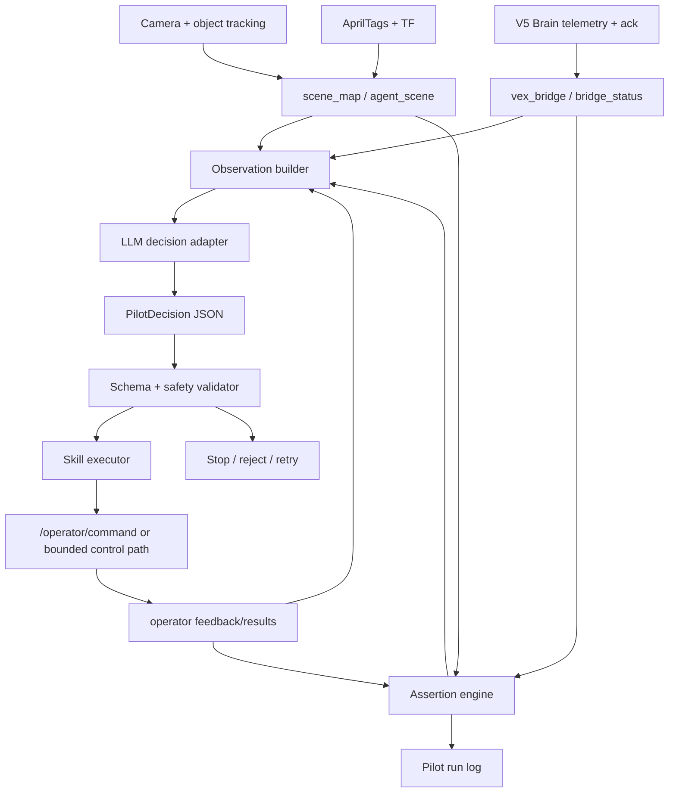
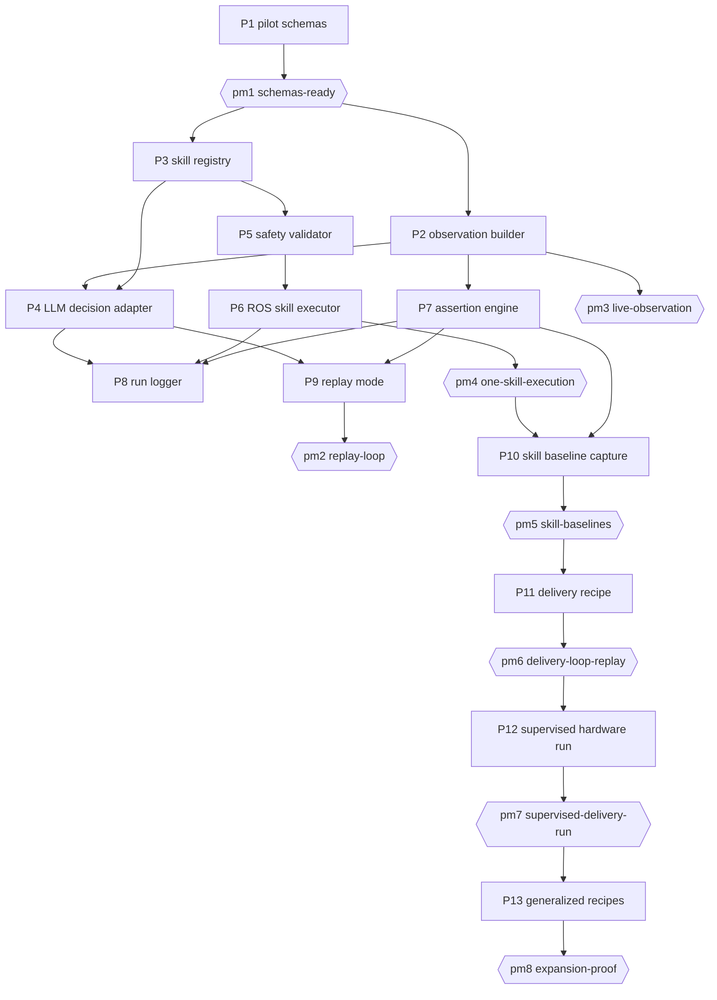

# Pilot Online Task Loop

| Field | Value |
|---|---|
| Driver | Online task completion for the VEX-V5 robot using a bounded LLM-in-the-loop pilot |
| Scope | `pilot/`, `contracts/`, `robot/ros2-runtime/`, `robot/v5-brain/` |
| Primary runtime | Raspberry Pi 5 + ROS 2 Jazzy + V5 Brain command bridge |
| Operating mode | Deterministic loop harness with bounded LLM judgment and validated skill execution |
| First task | Pick up a yellow ball at location A, carry it to location B, and release it |
| Expansion target | Reusable skills that compose into new tasks without rewriting the pilot loop |

> **Authority.** This document defines the online pilot requirements only. It intentionally does not
> describe the offline self-model generation loop except where online telemetry must remain exportable
> for later analysis. The active design goal is live task completion without recompiling controller code
> inside the task loop.

---

## Context

**What this is.** A runtime pilot that closes a live observe-judge-act loop on the robot. The robot
captures camera, map, operator, bridge, and motor evidence; the pilot condenses that evidence into a
small state snapshot; an LLM participates in the loop as a bounded judge and next-step selector; the
pilot validates the selected skill against schemas and safety state; the robot executes one bounded
skill; the result is evaluated; the loop repeats until success, failure, timeout, or human interrupt.

**Who it's for.** The immediate user is the robotics engineer trying to make the physical robot
complete a task despite imperfect perception, actuation, calibration, and grasp reliability. The
pilot should reduce manual trial-and-error by turning every run into structured feedback and bounded
recovery rather than code edits.

**The problem.** The current robot can run useful operator actions, capture telemetry, and expose
vision/map topics, but task success still depends on hand-written test scripts and post-run diagnosis.
PR #50 showed a useful pattern: telemetry revealed that the robot never entered the recovery path that
would move toward a predicted tag pose. That pattern should become a runtime behavior: when a bounded
skill fails, the pilot should inspect the live state and choose the next safe bounded skill without
changing code or rebuilding the ROS stack.

**Showcase thesis.** The memorable behavior is a robot that keeps its task objective in view, notices
why the last attempt failed, and recovers through smaller verified skills. For the ball-delivery task,
the audience should see the robot progress through search, approach, center, grasp, verify, transport,
release, and verify-drop steps, with the pilot log explaining each recovery in plain language.

### Execution Checklist

- **Contract first** — The pilot may only execute commands that validate against a closed skill schema.
- **Loop owner** — Deterministic Python owns iteration, timing, validation, interrupts, and stop logic.
- **LLM role** — The LLM is called inside the loop for structured judgment and next-skill selection; it
  is not allowed to publish directly to robot topics or run an unsupervised terminal loop.
- **Telemetry shape** — The LLM receives compact snapshots and recent outcomes, not raw unbounded logs.
- **Skill discipline** — Every executable skill has preconditions, parameters, postconditions, timeout,
  failure reasons, and telemetry output.
- **Assertion discipline** — Task progress is judged by fused assertions from vision, localization,
  operator state, bridge health, and motor feedback.
- **Bring-up ladder** — The full delivery task is blocked until smaller skills pass repeatable proof
  runs.
- **Safety** — Human interrupt, stale-telemetry stops, max iterations, max runtime, and command clamps
  are non-negotiable.

---

## Goal

Build an online pilot loop that can complete the first physical task without recompiling controller
code during the run:

> Find a yellow ball at source location A, approach and grab it, navigate to destination B, release it,
> and verify that the ball is at B.

The MVP is not a general robot intelligence system. It is a bounded loop over reusable skills. The
pilot should make visible progress on the task by composing smaller calibrated actions and recovering
from common failures such as object not visible, robot pose uncertain, missed approach, failed grasp,
or uncertain drop.

**Scope cut**

- **V1 — required:** pilot loop package; skill schema; compact observation snapshot; LLM decision
  prompt; action validator; ROS command executor; fused success assertions for the delivery task;
  pilot run log; dry-run/replay mode; hardware-supervised run mode.
- **V1.5 — required for reliable physical demo:** calibrated skill baselines for search, face target,
  approach target, center ball, claw close, verify grasp, carry short distance, navigate to destination,
  release, and verify drop.
- **V2 — stretch:** add new task recipes that reuse the same skills, such as inspect object, return
  home, touch tag, move object to alternate bin, or survey workspace.
- **OUT of scope:** letting the LLM emit arbitrary motor packets, recompiling code during a task run,
  free-running shell agents on the Pi, autonomous firmware mutation, or unbounded exploration.

---

## Tech stacks

**Shared tooling.** Python packages use `uv`; linting and formatting use `ruff`. ROS runtime remains
under `robot/ros2-runtime/`; Brain firmware remains PROS C++. The pilot should be a small Python
vertical that can run on the Pi and can also run in replay/dry-run mode on a dev machine.

- `pilot` — Python 3.11/3.12 · uv · ruff · ROS 2 client where running on the Pi · online task loop,
  LLM prompt/response handling, skill validation, execution orchestration, run logging.
  - root: `pilot/` · ignore_folders: `.venv`, `__pycache__`, `captures`, `runs`
- `contracts` — Python · pydantic v2 · owns pilot-facing schemas: skill command, observation
  snapshot, assertion result, pilot decision, and pilot run trace.
  - root: `contracts/`
- `coprocessor` — ROS 2 Jazzy · provides live topics: camera, object tracks, scene map, agent scene,
  operator status, action feedback/results, VEX ack/telemetry/bridge state.
  - root: `robot/ros2-runtime/`
- `brain` — PROS C++ · executes guarded low-level commands and reports ack/telemetry/fault state.
  - root: `robot/v5-brain/`

---

## Components

- **Pilot loop harness** `(pilot)` — owns the main loop: observe, ask/judge, validate, execute, wait,
  assert, log, continue/stop.
- **Observation builder** `(pilot)` — combines ROS topic cache into a compact LLM-facing snapshot with
  robot pose, visible objects, known tags, manipulator state, last command, last result, bridge health,
  and task progress.
- **LLM decision adapter** `(pilot)` — owns prompt templates, model invocation, JSON extraction,
  retry-on-invalid-output, and optional offline mock responses for tests.
- **Skill schema** `(contracts)` — owns the closed set of pilot skills and parameter limits. Skills are
  task-reusable actions, not one-off scripts.
- **Skill validator** `(pilot + contracts)` — validates LLM output, clamps safe numeric envelopes,
  checks preconditions, and refuses actions when telemetry or bridge health is stale.
- **Skill executor** `(pilot)` — maps validated skills to ROS `/operator/command`, `/task_plan/request`,
  or lower-level command paths as appropriate.
- **Assertion engine** `(pilot)` — computes task progress from fused evidence. The LLM may judge and
  explain, but deterministic assertions decide whether execution can continue.
- **Skill memory** `(pilot)` — stores calibrated baseline knowledge for each skill: typical duration,
  success indicators, known failure modes, safe step sizes, and recovery hints.
- **Task recipe** `(pilot)` — declarative description of the delivery objective and allowed skill
  sequence. Recipes can be changed without changing the loop harness.
- **Run logger** `(pilot)` — writes every observation, LLM decision, validated command, result,
  assertion, and stop reason to JSONL for replay and diagnosis.
- **Operator command surface** `(coprocessor)` — provides current high-level ROS actions such as tag
  alignment, survey, predicted tag movement, routines, arm, claw, and stop.
- **Object and scene perception** `(coprocessor)` — provides object tracks, agent scene summaries, tag
  map, robot pose confidence, and object reachability hints.
- **Brain safety boundary** `(brain)` — clamps physical motion, rejects invalid/unsafe commands, emits
  ack/fault state, and stops on watchdog/estop.

### Pilot data flow



---

## Sub-features

| # | Task | Vertical | Deps | MVP | Owner |
|---|------|----------|------|-----|-------|
| 1 | `P1` pilot-schemas — skill command, observation, assertion, decision, trace schemas | contracts | — | yes | 215eight |
| 2 | `P2` observation-builder — compact snapshot from live ROS topic cache | pilot | P1 | yes | 215eight |
| 3 | `P3` skill-registry — reusable skills with preconditions, parameter limits, and result mapping | pilot | P1 | yes | 215eight |
| 4 | `P4` llm-decision-adapter — structured prompt, JSON response parsing, retry on invalid output | pilot | P1, P2, P3 | yes | 215eight |
| 5 | `P5` safety-validator — stale state checks, numeric clamps, max step/time limits, stop policy | pilot | P1, P3 | yes | David |
| 6 | `P6` ros-skill-executor — publish validated skills and wait for terminal feedback/result | pilot | P3, P5 | yes | David |
| 7 | `P7` assertion-engine — fused task assertions for visibility, pose, grasp, carry, drop | pilot | P2 | yes | David |
| 8 | `P8` run-logger — JSONL trace for every loop iteration and command outcome | pilot | P2, P4, P6, P7 | yes | David |
| 9 | `P9` replay-mode — run loop against recorded snapshots/results without moving hardware | pilot | P2, P4, P7, P8 | yes | David |
| 10 | `P10` skill-baseline-capture — supervised proof runs for each small skill | pilot + coprocessor | P6, P7, P8 | yes | David |
| 11 | `P11` delivery-recipe — ball A to destination B task plan over reusable skills | pilot | P3, P7, P10 | yes | David |
| 12 | `P12` supervised-hardware-run — full loop with human interrupt and hard stop policy | pilot + coprocessor + brain | P5, P6, P8, P11 | yes | David |
| 13 | `P13` generalized-recipes — add non-ball tasks using the same skill registry | pilot | P12 | stretch | David |

---

## Skill Model

The pilot executes skills, not arbitrary code. Skills are small enough to verify and broad enough to
compose into future tasks.

### Required primitive skills

- `stop` — immediately halt motion with a structured reason.
- `survey_scene` — rotate or scan within bounded duration and angular velocity.
- `face_target` — turn toward an object, tag, pose, or destination.
- `approach_target` — move a short bounded distance toward a target while preserving safety margins.
- `center_object_in_gripper` — adjust pose until the object is inside the grasp corridor.
- `arm_to_angle` — move arm to a bounded physical angle.
- `claw_open` / `claw_close` — actuate claw with bounded duration/force.
- `verify_grasp` — determine whether the object is probably held.
- `go_to_destination` — navigate toward a destination using map pose or tag-relative fallback.
- `verify_drop` — determine whether released object is at the destination.

### Skill contract

Each skill must define:

- inputs and defaults
- preconditions
- maximum duration
- maximum movement envelope
- command path
- expected result topic or ack source
- success assertion
- failure reasons
- recovery hints

Example shape:

```json
{
  "skill": "approach_target",
  "target": {"type": "object", "id": "yellow_ball_1"},
  "constraints": {
    "max_step_m": 0.15,
    "target_standoff_m": 0.18,
    "timeout_s": 4.0
  }
}
```

---

## Observation and Assertions

The pilot must not ask the LLM to reason over raw logs. It builds a compact state snapshot every
iteration.

### Observation snapshot

The snapshot should include:

- task objective and current phase
- robot pose, localization source, pose confidence, and pose age
- visible tags and missing anchor tags
- tracked objects with class, id, confidence, pose, uncertainty, age, and reachability
- manipulator state: arm position, claw state if known, held-object estimate
- bridge health, ack freshness, telemetry freshness, estop, motion enabled
- last skill command and terminal result
- recent failure reasons
- current assertions and confidence

### Assertions

Assertions are task-facing facts computed from fused evidence. Required assertions for the first task:

- `target_ball_visible`
- `robot_pose_reliable`
- `ball_reachable`
- `ball_centered_for_grasp`
- `grasp_likely`
- `carrying_ball`
- `at_destination`
- `drop_likely`
- `ball_at_destination`

No single sensor is sufficient for grasp or delivery. These assertions should combine:

- camera/object tracking
- scene-map pose and confidence
- operator status
- motor current/position where available
- claw/arm command results
- bridge ack/fault state

---

## LLM Role

The LLM participates in every pilot iteration, but the deterministic harness owns the loop.

The LLM may:

- summarize why the previous skill did or did not advance the task
- choose the next skill from the allowed registry
- set bounded skill parameters
- explain recovery intent for the run log
- label ambiguous outcomes when deterministic assertions are inconclusive

The LLM may not:

- publish directly to ROS topics
- execute shell commands
- edit source code
- bypass schema validation
- command raw unbounded motor motion
- continue after the harness has stopped for safety

The initial MVP may run the LLM in an advisor/evaluator mode for fragile skills: deterministic recipes
select the next skill, while the LLM judges the observation and suggests recovery. Once skill
assertions are stable, the LLM can select the next skill directly from the registry.

---

## Prompt Contract

The prompt must be short, structured, and repeatable.

Required input sections:

- objective
- current phase
- observation snapshot
- assertions
- last skill and result
- recent history
- allowed skills
- safety constraints
- output schema

Required output:

```json
{
  "decision": "continue",
  "skill": {
    "name": "survey_scene",
    "parameters": {
      "duration_s": 3.0,
      "omega_rad_s": 0.22
    }
  },
  "reason": "The target ball is not visible and localization is healthy, so perform a short survey.",
  "expected_progress": "target_ball_visible becomes true"
}
```

Other valid decisions:

- `continue`
- `retry`
- `stop_success`
- `stop_failure`
- `request_human`

---

## Milestones

1. **`pm1` schemas-ready** *(automated; owner: 215eight)* — Pilot schemas validate examples for
   observations, skills, decisions, assertions, and run traces.
2. **`pm2` replay-loop** *(automated; owner: David)* — Pilot can run a full observe-decide-act trace
   in replay mode without ROS hardware and stop for success/failure.
3. **`pm3` live-observation** *(manual; owner: 215eight)* — Pilot builds live snapshots from ROS
   topics without commanding motion. Manual because it requires a live robot connection.
4. **`pm4` one-skill-execution** *(manual; owner: David)* — Pilot executes one validated skill, waits
   for terminal result, logs outcome, and stops safely. Manual because it commands the robot.
5. **`pm5` skill-baselines** *(manual; owner: David)* — Search, face, approach, center, grasp, verify,
   navigate, release, and verify-drop each have supervised proof runs and baseline memory. Manual
   because these runs require robot setup and physical supervision.
6. **`pm6` delivery-loop-replay** *(automated; owner: David)* — Full ball-delivery recipe succeeds in
   replay using recorded observations and mocked decisions.
7. **`pm7` supervised-delivery-run** *(manual; owner: David)* — Full pilot loop attempts the physical
   delivery task with human interrupt, hard limits, and complete trace logging. Manual because it is a
   live robot task run.
8. **`pm8` expansion-proof** *(automated; owner: David)* — Add one new task recipe using the same
   skill registry without changing the loop harness. Automated unless the selected expansion recipe is
   explicitly promoted to a live hardware proof.

---

## Sequencing



---

## Constraints

- The pilot must stop on stale bridge ack, stale telemetry, estop, disabled motion, command rejection,
  bridge fault, or missing human supervision flag during hardware mode.
- Every movement skill must have a maximum duration and bounded displacement or velocity envelope.
- Every loop run must have max iterations and max wall-clock runtime.
- The LLM response must be parsed as JSON and validated before execution.
- Invalid LLM output must not reach the robot.
- The loop must be replayable from saved observations and results.
- The pilot must log enough context to understand why a skill was selected and why it passed or failed.
- The first physical task may use current operator actions, but pilot abstractions must be skill-based
  so additional tasks can reuse the loop.
- High-level one-off task commands should not become the only action surface.
- Raw low-level drive/turn commands are allowed only behind short TTLs, strict clamps, and safety
  preconditions.

---

## Verification

Reviewer commands should eventually include:

```bash
uv sync
make test
make validate
```

Pilot-specific checks should cover:

- schema validation for example observations, decisions, skills, assertions, and run traces
- prompt adapter rejects malformed LLM output
- safety validator rejects stale telemetry and oversized motion
- replay loop terminates on success, failure, and max-iteration stop
- executor maps each skill to the correct ROS command path
- assertion engine classifies grasp/drop examples from recorded fused evidence
- run logger writes complete JSONL traces

Hardware verification should be staged:

```bash
# observe only
pilot observe --duration-s 30

# replay a recorded task trace
pilot run --mode replay --trace fixtures/pilot_delivery_trace.jsonl

# execute one supervised skill
pilot skill --hardware --skill survey_scene --duration-s 3.0

# full supervised task loop
pilot run --hardware --task deliver-yellow-ball --max-iterations 20
```

---

## Decisions

| ID | Decision | Rationale | Rejected |
|---|---|---|---|
| P-ADR-01 | Deterministic harness owns the loop | Safety, replayability, and testability require code-level control of iteration and stop conditions | Free-running LLM terminal loop |
| P-ADR-02 | Skills are the execution unit | Skills can be calibrated, verified, logged, and recombined across tasks | Task-specific script-only actions |
| P-ADR-03 | LLM output is advisory until validated | Prevents invalid or unsafe commands from reaching ROS/Brain | Direct LLM publication to `/operator/command` |
| P-ADR-04 | Assertions fuse camera and motor evidence | Grasp/drop/arrival cannot be proven from one source alone | Trusting object detection or motor ack alone |
| P-ADR-05 | Build skill baselines before full task attempts | The robot currently cannot reliably grab the ball; smaller proofs reduce search space | Jumping directly to full delivery loops |
| P-ADR-06 | Replay mode is first-class | Debugging the pilot should not require moving hardware on every iteration | Hardware-only development |
| P-ADR-07 | Current operator actions may back MVP skills | They reduce scope for the first task while preserving a reusable pilot abstraction | Rewriting all controllers before proving the loop |

---

## Open Questions

- **O1** What is the minimum sensor evidence needed to mark `grasp_likely` with acceptable confidence?
- **O2** Can current object tracking localize the yellow ball precisely enough for a reusable
  `center_object_in_gripper` skill?
- **O3** Should the first destination B be a tag-relative pose, a bin object, or a fixed map pose?
- **O4** Which LLM runtime is acceptable on the Pi: remote API, local model, or desktop-assisted loop?
- **O5** Should raw `drive` / `turn` be exposed to the LLM at all, or only through named skills?
- **O6** What human-supervision signal should unlock hardware execution: CLI flag, ROS topic, joystick
  deadman, or physical button?
- **O7** How should skill memory be versioned when calibration changes after hardware modifications?

---

## Risks

- **Perception ambiguity** — The camera may lose the ball during grasp or carry. Mitigation: combine
  object tracks with claw/arm/motor evidence and allow `unknown` assertions.
- **Over-granular control** — Exposing raw motor commands could make the LLM behave like an unstable
  servo. Mitigation: prefer bounded skills and short TTLs.
- **Task-specific lock-in** — Building only `deliver_ball` would limit reuse. Mitigation: require the
  skill registry and add one expansion proof.
- **False success** — The robot might think it grabbed or dropped the ball when it did not. Mitigation:
  use fused assertions and require visible confirmation where possible.
- **Long recovery loops** — The pilot may keep trying low-value actions. Mitigation: max iterations,
  no-progress detection, and request-human states.
- **LLM latency** — Remote or large-model calls may slow control. Mitigation: skills are long enough
  to tolerate planning latency; low-level control remains deterministic.

---

## Definition of Done

The pilot feature is complete when a supervised hardware run can attempt the ball-delivery task
without recompilation, with all commands passing through validated skills, all outcomes logged, and the
loop stopping cleanly on success, failure, timeout, or human interrupt. The run does not need to be
perfect on the first physical attempt, but failures must be diagnosable from structured assertions and
the next required skill calibration must be clear.
