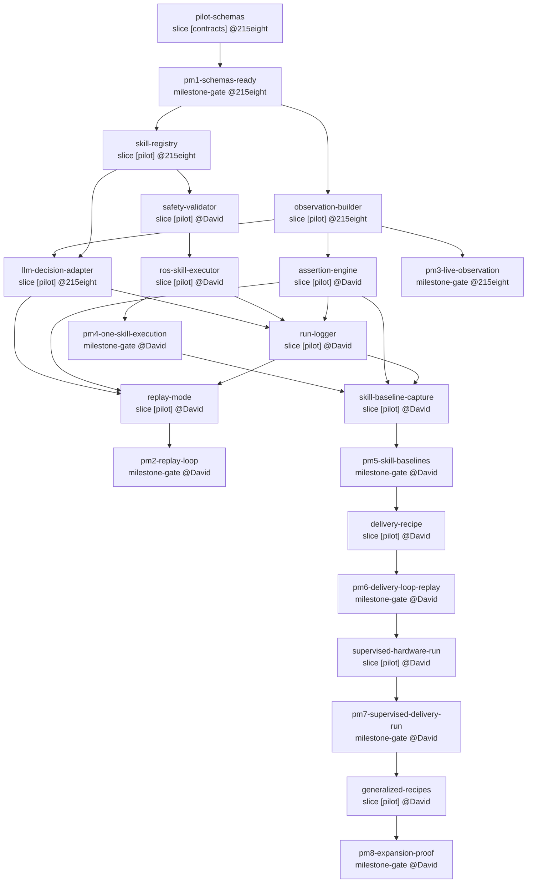

# Pilot Online Task Loop Program Graph

Source program:

- Requirements: `.ai-sdd/programs/pilot-online-task-loop/requirements.md`
- Pipeline: `.ai-sdd/programs/pilot-online-task-loop/pipeline.yaml`

Generated from:

```bash
ai-sdd graph .ai-sdd/programs/pilot-online-task-loop
```


