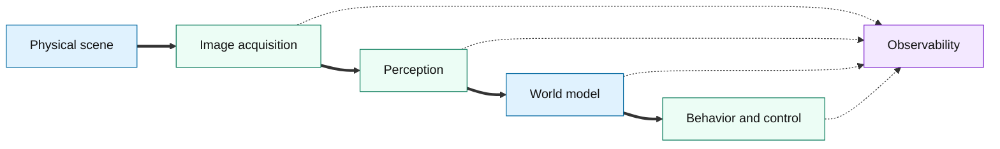
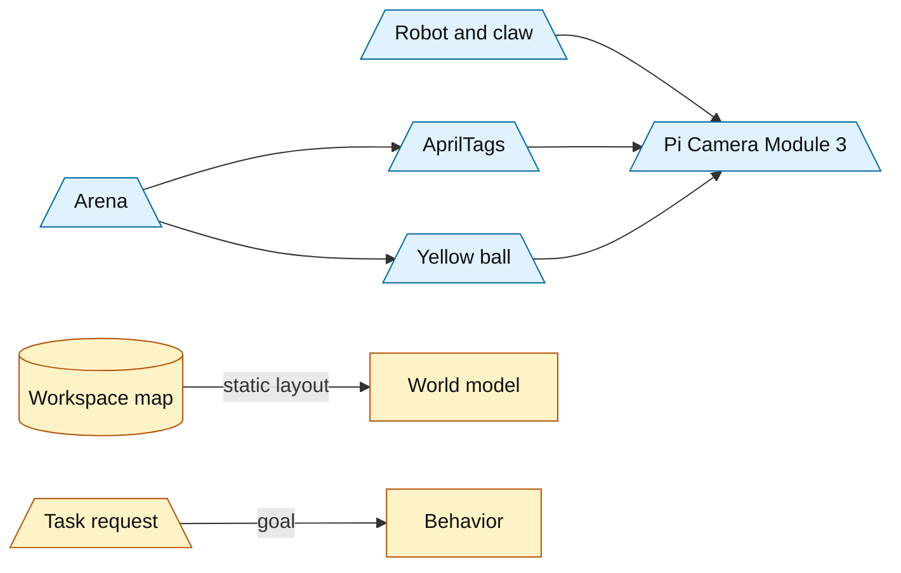
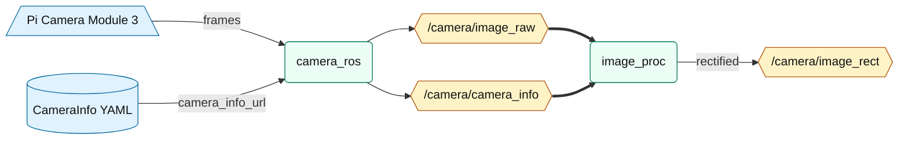
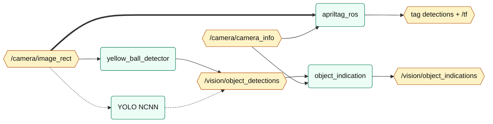
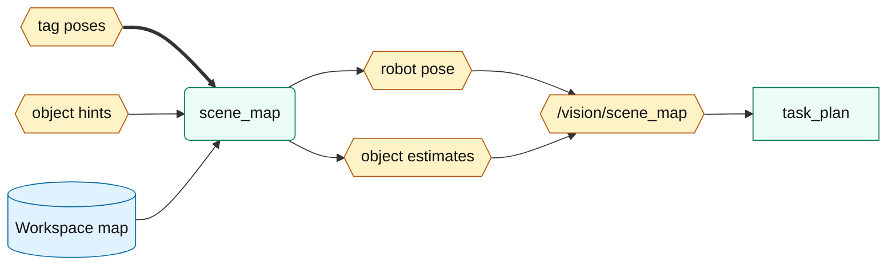
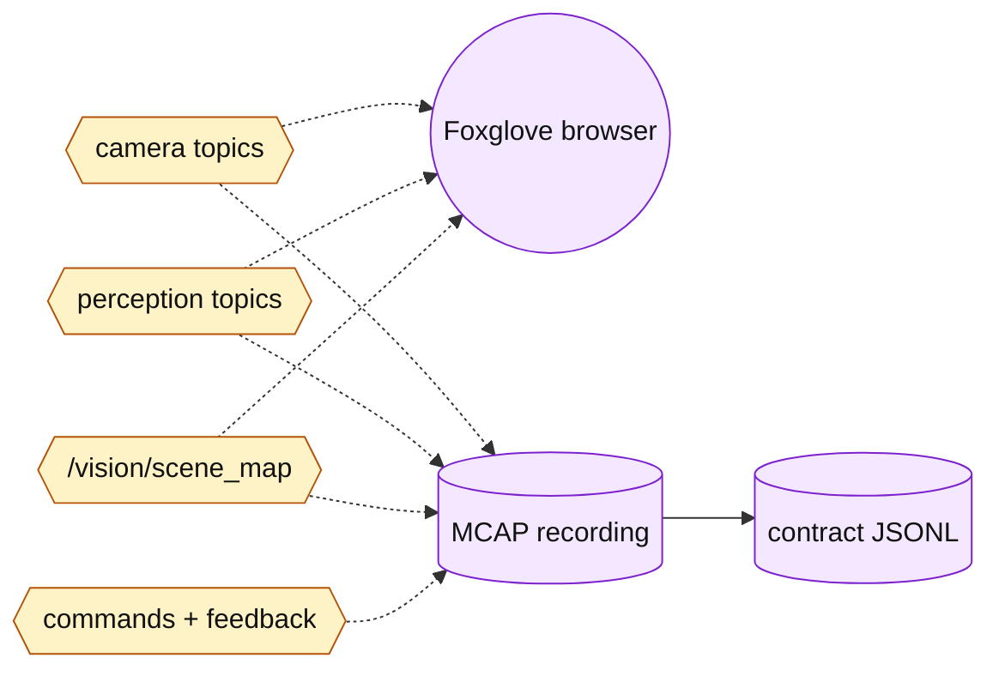

# VEXY Vision Input, Processing, and Usage

> Auto-generated from `wiki/knowledge/entities/components/vexy-ros-runtime.md` by `mermaid-flowchart` skill.

## Master Overview

## Physical Scene

## Image Acquisition

## Perception

## World Model

## Behavior And Control

```mermaid
flowchart LR
    TaskRequest[/Task request\]
    SceneTopic{{/vision/scene_map}}
    TaskPlan(task_plan)
    LocalSkill("align_to_tag / survey_scan")
    VexCmd{{/vex/cmd}}
    VexBridge(vex_bridge)
    Brain[VEX V5 Brain]
    Motors[/Drive + effector motors\]
    Feedback{{"acks + telemetry"}}

    TaskRequest --> TaskPlan
    SceneTopic --> TaskPlan
    TaskPlan -->|bounded goal| LocalSkill
    LocalSkill --> VexCmd
    VexCmd --> VexBridge
    VexBridge -->|serial JSON| Brain
    Brain --> Motors
    Brain --> Feedback

    classDef input fill:#e0f2fe,stroke:#0369a1,color:#111;
    classDef process fill:#ecfdf5,stroke:#047857,color:#111;
    classDef topic fill:#fef3c7,stroke:#b45309,color:#111;
    classDef output fill:#f3e8ff,stroke:#7e22ce,color:#111;
    class TaskRequest,Motors input;
    class TaskPlan,LocalSkill,VexBridge process;
    class SceneTopic,VexCmd,Feedback topic;
    class Brain output;
```

## Observability

## Notes

- Every Mermaid chart in this file has nine nodes or fewer.
- The grouping follows natural runtime boundaries: physical scene, image acquisition, perception, world model, behavior/control, and observability.
- `yellow_ball_detector` is the default object detector; `yolo_ncnn` is optional and disabled until a model path is supplied.
- Object indications are coarse camera-relative hints, not proof that a ball is inside the claw.
- The calibrated AprilTag path depends on `camera_info_url`, `/camera/camera_info`, and rectified `/camera/image_rect` being valid.
