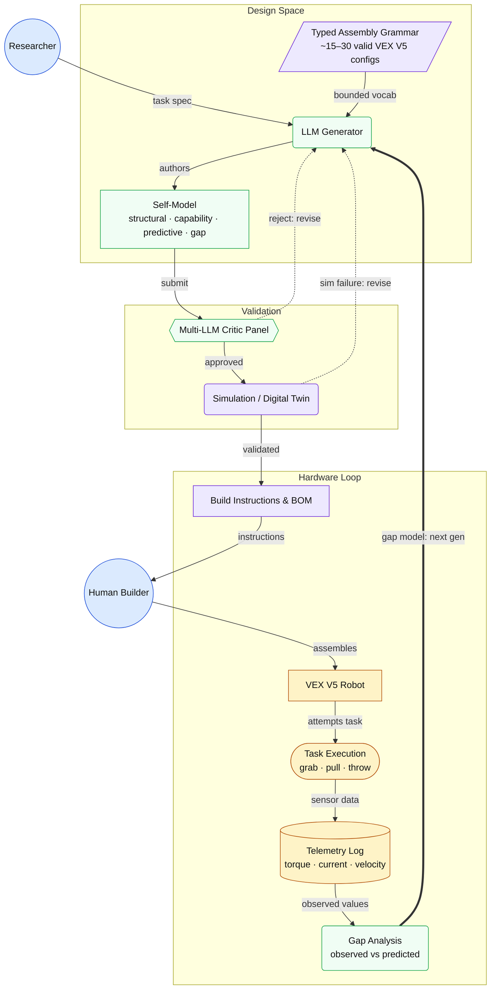

# Capstone Experiment — 30,000 ft Overview

> Auto-generated from `wiki/knowledge/concepts/llm-authored-self-model.md` (+ `task-telemetry-contract.md`, `typed-assembly-grammar.md`, `physical-robot-software-factory.md`) by `/mermaid-flowchart`.

## Notes

- **Solid arrows** (`-->`) = forward generation flow. **Dotted arrows** (`-.->`) = revision loops (Critics reject or sim fails → LLM revises). **Thick arrow** (`==>`) = the primary learning signal closing the generational loop.
- The `Grammar` node represents the bounded VEX V5 design space (~15–30 valid configurations across 6 parameters); it constrains every self-model the LLM can author.
- `Multi-LLM Critic Panel` is adversarial by design — each critic is prompted to find a specific failure mode (CoM too high, torque budget violated, sensor occlusion, etc.) before any physical build is committed.
- Digital Twin / Simulation validation is listed as a mandatory pipeline stage but the specific sim toolchain (Gazebo vs. Isaac Sim vs. PyBullet) has not yet been decided — flagged as `% TODO: verify sim stack`.
- The `Gap Analysis` node maps directly to the Task Telemetry Contract (`predicted`, `observed`, `gap` JSON blocks) for grab, pull, and throw primitives; the `gap` block is the exact residual fed back to the LLM Generator each generation.
