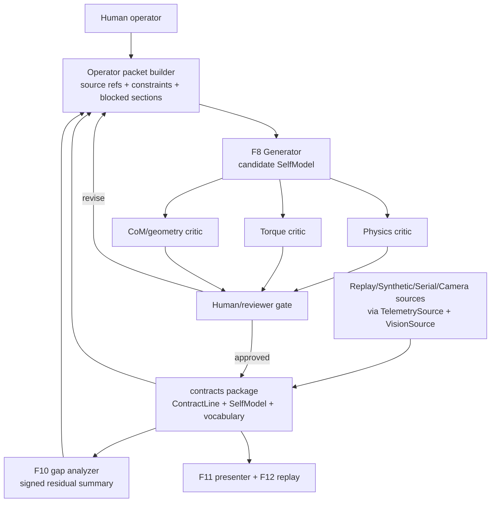

# LLM/Critic Architecture

## Purpose

This document is the bridge from Grace's pre-schema LLM/Critic requirements to
the concrete F8/F9 implementation slices. It does not implement the Generator or
Critic panel yet. It freezes the architecture vocabulary the team should use
when those slices are created.

The core rule is simple: `operator/` orchestrates LLM work, but `contracts/`
owns the durable shapes. The Generator and Critics consume `ContractLine`,
`SelfModel`, and shared vocabulary from `contracts`; they do not create a second
telemetry schema, self-model schema, or parts vocabulary.

## Current Repo Grounding

As of 2026-06-24, the architecture can assume:

| Repo surface | Status | LLM/Critic implication |
|---|---|---|
| `contracts.ContractLine` | Merged in F1 | Generator and gap analysis read task evidence from this envelope. |
| `contracts.SelfModel` | Merged in F2 / PR #13 | Generator output is a candidate `SelfModel`; Critics inspect that same object. |
| `contracts.vocabulary` | Merged in F2 / PR #13 | `SelfModel.config` values come from shared enums, not prompt-invented strings. |
| `TelemetrySource` / `VisionSource` | Merged in F4 / PR #14 | Runtime sources can be replay, synthetic, serial, or camera without changing operator logic. |
| ROS 2 align-to-tag evidence path | Approved software PR #15 | MCAP/raw ROS proof should be exported into `ContractLine` before the operator loop consumes it. |

F3 parts-catalog grammar and F10 gap analyzer are still dependencies for full
F8 Generator implementation. Until they land, the Generator packet must label
those sections blocked or fixture-backed.

## System Flow

ELI5 version: the robot does a task, the repo turns that into official contract
evidence, the Generator proposes "what the robot thinks it is now," three
Critics try to catch bad assumptions, and a human approves the next build or
sends it back for revision.

## Operator Roles

| Role | Feature | Responsibility | Must not do |
|---|---|---|---|
| Packet Builder | F8/F10 support | Collects contract evidence, current self-model, gap summary, parts constraints, and blocked-state notes. | Invent missing schemas or hide source gaps. |
| Generator | F8 | Produces a candidate `SelfModel` for Gen 0 or Gen N+1. | Read hidden oracle parameters or output prose instead of schema-aligned content. |
| Physics Critic | F9 | Flags physically implausible capability, motion, or outcome claims. | Approve the design alone. |
| Torque Critic | F9 | Flags motor/load/force claims that do not match VEX constraints or observed motor evidence. | Guess unknown motor specs when source data is missing. |
| CoM/Geometry Critic | F9 | Flags reach, center-of-mass, connection, and buildability risks. | Replace the parts catalog or build grammar. |
| Human Gate | F9/F11 | Decides whether critic flags are resolved enough to approve a candidate. | Let the critic panel self-approve. |

Critics are stateless by default. Each review run receives the candidate
`SelfModel`, the relevant evidence packet, and an explicit scope. Persistent
learning belongs in versioned repo artifacts, not hidden critic memory.

## Generator Contract

### Inputs

| Input | Source of truth | Required now? | Notes |
|---|---|---|---|
| Current or prior `SelfModel` | `contracts.SelfModel` fixtures or approved generation file | Yes for Gen N+1; no for Gen 0 | Gen 0 uses `parent_generation = null`. |
| Task evidence | `ContractLine` JSONL | Yes | Use `task`, `predicted`, `gap`, `outcome`, `vision`, and `motor_samples`. |
| Gap summary | F10 gap analyzer | Blocked until F10 | Fixture summaries are allowed if labeled fixture-backed. |
| Parts vocabulary | F3 parts catalog + `contracts.vocabulary` | Partly blocked until F3 | F2 config enums exist; buildable combination rules still need F3. |
| Human constraints | Operator packet markdown | Yes | Demo task, available hardware, time, and safety limits. |
| Hidden oracle parameters | Never | No | Information separation is part of the thesis. |

### Outputs

The Generator returns one candidate `SelfModel` plus a short handoff note.

The candidate must include:

- `schema_version`
- `generation`
- `parent_generation`
- `config`
- `structural`
- `capability`
- `predictive`
- `gap_model`
- keyed `reasoning`

The handoff note must include:

- changed fields;
- evidence used;
- blocked assumptions;
- critic review request scope.

The Generator must preserve residual-key traceability. If F10 says the gap key
is `force_error_N`, the Generator should update or explain `gap_model` using
that same key rather than renaming it in prompt prose.

## Critic Panel Contract

Each Critic receives the same candidate `SelfModel`, but a different review
scope.

| Critic | Primary fields | Example flags |
|---|---|---|
| Physics | `capability`, `predictive`, `gap_model`, `structural` | predicted motion violates known geometry; capability claim has no evidence; gap update has wrong sign. |
| Torque | `capability`, `predictive`, `motor_samples`, parts specs | predicted pull/load exceeds motor budget; torque evidence ignored; motor heat/current trend not addressed. |
| CoM/Geometry | `config`, `structural`, `capability`, parts rules | center of mass too high; connection graph is build-infeasible; sensor/camera line of sight is blocked. |

Each Critic returns:

- `pass` or `flag`;
- cited field or section;
- rationale;
- suggested correction when useful;
- uncertainty or blocked dependency.

For the MVP, Critic outputs can be markdown with a strict heading template. If
F9 needs a formal `CriticReview` model later, the team should decide whether it
belongs in `contracts/` before treating it as durable schema.

## Blocked-State Rules

The LLM must say when a required dependency is missing. Use exact blocked labels
inside packets, prompt outputs, and reviews:

- `[BLOCKED: awaiting F3 parts-catalog valid-config rules]`
- `[BLOCKED: awaiting F10 gap analyzer residual summary]`
- `[BLOCKED: no ContractLine evidence for this task]`
- `[BLOCKED: hardware proof not recorded as contract-valid JSONL]`

Blocked sections are allowed in architecture docs and fixture tests. They are
not allowed to silently become invented field names, units, or build rules.

## Information Separation

The synthetic oracle can know hidden truth. The Generator cannot.

Allowed Generator evidence:

- contract-valid observed telemetry;
- vision observations;
- approved prior self-models;
- visible parts catalog constraints;
- F10 residual summaries.

Forbidden Generator evidence:

- hidden synthetic oracle parameters;
- answer keys from a fixture;
- private critic chain-of-thought;
- hardware claims not exported into contract evidence.

This is what makes the demo honest: improvement must come from observed gap
residuals, not from leaking the answer.

## Resource Assessment

The offline LLM/Critic loop is allowed to run outside the Raspberry Pi. The Pi
should run capture, replay, bridge, and bounded local control; the Generator and
Critics can run through Claude Code or an external API/runtime because they are
not in the fast control loop.

| Question | Initial answer | Follow-up needed |
|---|---|---|
| Can Pi 5 8GB run Generator + 3 Critics locally? | Not a safe MVP assumption. Treat as feasibility research, not a requirement. | Benchmark only if local LLM becomes a hard requirement. |
| Is external runtime acceptable? | Yes for offline F8/F9. | Keep prompts and outputs saved for replay. |
| Latency tolerance | Seconds to minutes per generation is acceptable. | Online control belongs to `pilot`, not this doc. |
| Heaviest prompt contents | Current self-model, parts constraints, contract evidence, and gap summary. | Packet builder should trim to task-relevant evidence. |
| Caching | Approved self-models, prompt packets, critic reviews, and generated candidates can be cached. | Store under a future operator run directory. |

## Conversion To F8/F9 Slices

After this doc is accepted, split implementation into small AI-SDD slices:

| Slice | Feature | Deliverable |
|---|---|---|
| `operator-packet-builder` | F8 support | Builds a markdown/JSON packet from `SelfModel`, `ContractLine` JSONL, human constraints, and blocked-state notes. |
| `generator-prompt-and-fixtures` | F8 | Prompt skeleton plus fixture proving Gen 0 and Gen N+1 candidate output validates against `contracts.SelfModel`. |
| `generator-gap-revision` | F8 | Uses a fixture F10 residual summary to revise `predictive`, `gap_model`, and keyed `reasoning`. |
| `critic-prompt-panel` | F9 | Three stateless critic prompt templates: physics, torque, CoM/geometry. |
| `critic-review-aggregation` | F9 | Aggregates pass/flag reviews into a human-gate report without self-approval. |
| `planted-fault-critic-tests` | F9 | Fixtures with known bad self-models that each critic must flag. |

Suggested order: build the packet builder first, then Generator fixture output,
then critic prompts, then planted-fault tests. That keeps every step tied to
visible repo data.

## Acceptance Checklist

- Generator inputs reference `contracts.ContractLine`, `contracts.SelfModel`,
  and shared vocabulary.
- Critic panel has exactly three lanes: physics, torque, CoM/geometry.
- Missing F3/F10 data is labeled blocked.
- No schema is duplicated under `operator/`.
- Hidden oracle parameters are explicitly forbidden.
- Resource assessment separates offline LLM work from on-Pi control.
- The F8/F9 slice list is small enough for AI-SDD planning.

## Plain-English Handoff

Grace can say:

> I built the LLM/Critic architecture doc. It keeps schemas in `contracts`,
> defines the Generator and three stateless Critics, names the missing F3/F10
> blockers, and translates the work into F8/F9 implementation slices.
