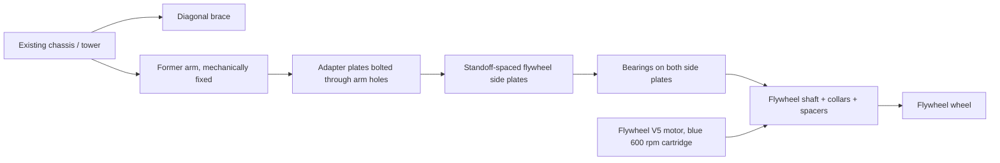
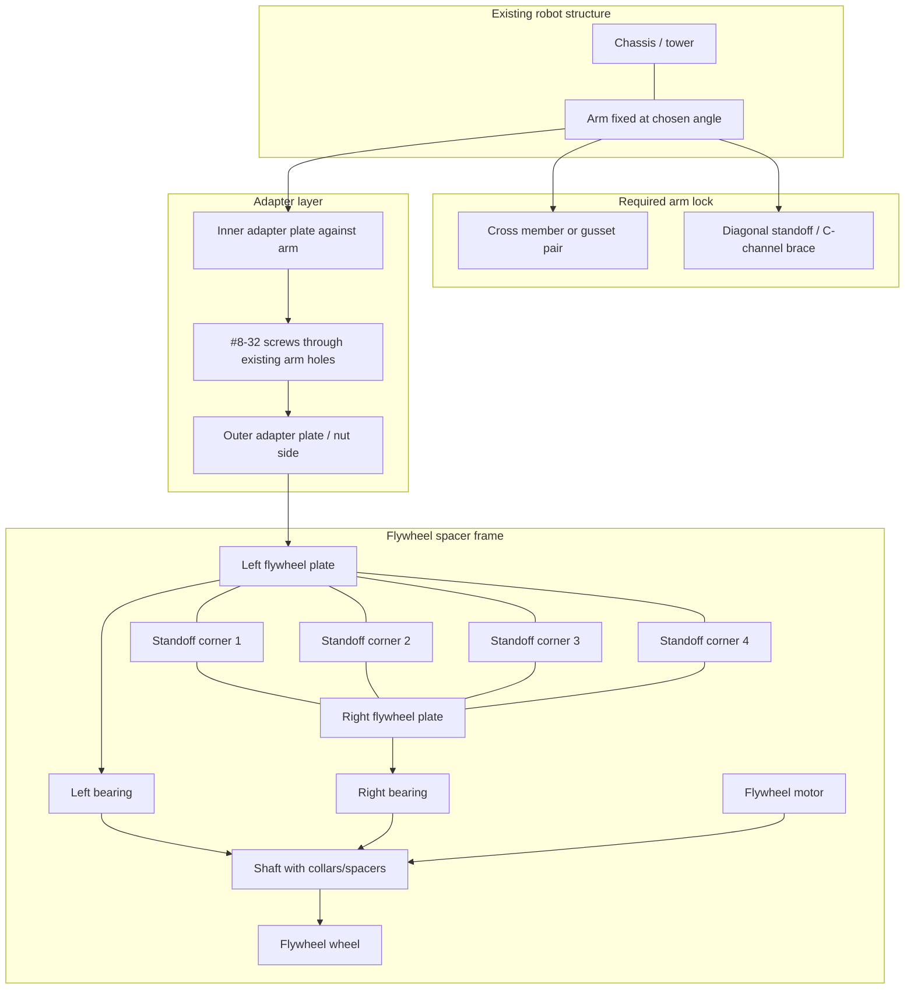

# Research: Flywheel Arm Retrofit

> Yes, the flywheel plates can likely be attached to a stationary VEX V5 arm, but the arm must be mechanically locked and braced first. Do not rely on an unplugged arm motor as the structural lock. Treat the arm as a fixed tower, bolt adapter plates to the arm's existing VEX hole pattern, then build a two-plate flywheel cassette around it with standoffs, bearings, shaft collars/spacers, and triangulated bracing back to the chassis.

## Research Questions

- Can a VEX V5 arm be converted from moving to fixed structure for a flywheel mount?
- What plate/standoff layout should be used for a flywheel spacer frame?
- What is required if the arm motor is unplugged or removed?
- What risks must be controlled for a high-speed flywheel on a former arm?

## Current State (Codebase)

The repo's operating context is a VEX V5 robot project with a V5 brain, V5 brain code, Pi coprocessor, telemetry, and online/offline LLM control loops [S1]. No repo artifact found in this pass defines the exact physical arm geometry, flywheel CAD, or hole coordinates, so the layout below is a sourced concept pattern rather than a dimensioned build instruction.

Related prior research exists at `raw/research/vex-flywheel-structure-parts/`; this report focuses only on the stationary-arm retrofit question.

## Key Findings

- VEX's own chassis guidance identifies standoffs as the normal way to separate structural parts while creating a rigid connection [S2].
- VEX's motor mounting guide for the Clawbot arm uses #8-32 screws and emphasizes that the motor must be securely mounted and aligned with the gear it turns [S3].
- VEX identifies the blue 6:1, 600 rpm cartridge as the low-torque/high-speed option for intakes, flywheels, and other fast mechanisms [S4].
- The V5 Brain has 21 Smart Ports and allows on-the-fly device connection and port swapping, so electrically removing the former arm motor is plausible from the control-system side [S5].
- VEX's launching-system guidance frames flywheels as spinning wheels fed at high speed; therefore the structure must handle vibration, wheel inertia, and launch reaction force, not just static weight [S6].
- For higher-load flywheel shafts, VEX's high-strength hardware guidance recommends bearings for shaft support and spacers for positioning/reducing friction [S7].
- Community flywheel troubleshooting strongly recommends support on both sides of the channel and two bearing flats per axle; this is not official VEX documentation, but it matches the mechanical risk of a cantilevered high-speed wheel [S8].

## Constraints

- The exact existing arm layout is unknown. Before drilling, cutting, or ordering parts, measure the arm's VEX hole pitch, available side clearance, and launch path.
- If the old arm motor is unplugged, it no longer provides active holding torque. Even a connected motor should not be treated as the only lock for a high-speed add-on.
- The flywheel assembly should be removable as a cassette so the arm can be restored or adjusted without rebuilding the whole robot.
- The retrofit needs a rigid load path: flywheel cassette -> adapter plates -> fixed arm -> chassis/tower brace.

## Recommended Layout

Use a sandwich/cassette mount:

1. Lock the arm at the chosen angle with structural metal, not software.
2. Add one adapter plate on each side of the stationary arm, bolted through existing arm holes with #8-32 screws, nuts, and washers.
3. Add standoffs between the outer flywheel side plates to create a rigid rectangular frame.
4. Put bearings in both flywheel side plates so the shaft is supported on both sides.
5. Add collars/spacers to locate the wheel and keep it from rubbing the plates.
6. Add diagonal bracing from the cassette or fixed arm back down to the chassis/tower.

### Side Layout

### Exploded Spacer-Frame Assembly Onto Fixed Arm

## Answer To The Build Question

Assuming the arm is fixed, yes: attach the flywheel plates to the stationary arm through an adapter layer, not by hanging the flywheel directly off one unsupported side of the arm.

If the arm motor is taken out of commission:

- Unplug/remove the former arm motor from the V5 Smart Port and update the robot code/config so the arm motor is no longer commanded.
- Mechanically lock the arm with metal bracing: at minimum a rigid cross member/gusset pair, preferably a triangular brace from the arm down to the chassis/tower.
- If the motor is physically removed, use the freed mounting holes as structural attachment points only after replacing any stiffness the motor body previously contributed.
- Mount the flywheel motor as part of the flywheel cassette, aligned to the flywheel shaft or gear/chain path. Do not use the old arm output as the only support point.
- Use two bearing supports for the flywheel shaft, with collars/spacers on the shaft to prevent side play and rubbing.
- Add a quick inspection checklist: no shaft wobble, no plate flex, wheel clears the arm through vibration, wires strain-relieved, launch path clear, and fasteners tight.

## Recommendation

Build a bolt-on flywheel cassette that clamps to the fixed arm with adapter plates and standoffs. The stationary arm should act like a tower, while the cassette carries the flywheel shaft, bearings, motor, and wheel. This keeps the high-speed rotating assembly self-contained and makes the arm-to-flywheel interface mostly structural.

Do not proceed by merely unplugging the arm motor and bolting one plate to the arm. That creates three likely failures: the arm can drift, the flywheel shaft can cantilever, and vibration can loosen or twist the arm.

## Next Steps

- Measure the current arm: hole pattern, width, target launch height, wheel diameter, and side clearance.
- Sketch the adapter plate using real holes before cutting or assembling.
- Create a task if this needs implementation in project docs: `/task-add Draft a dimensioned VEX V5 fixed-arm flywheel retrofit with adapter plates, standoff frame, and validation checklist`.
- Use the `wiki-ingest` skill on this report if the research should become part of the project knowledge base.
