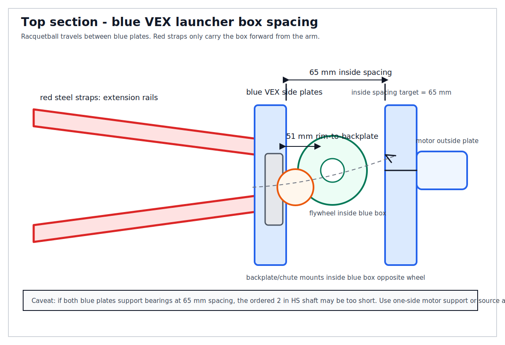
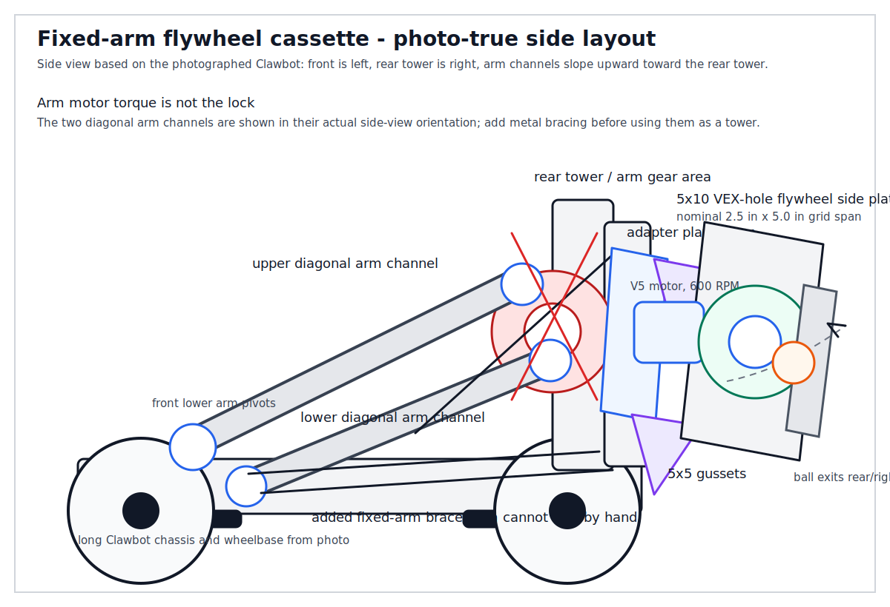
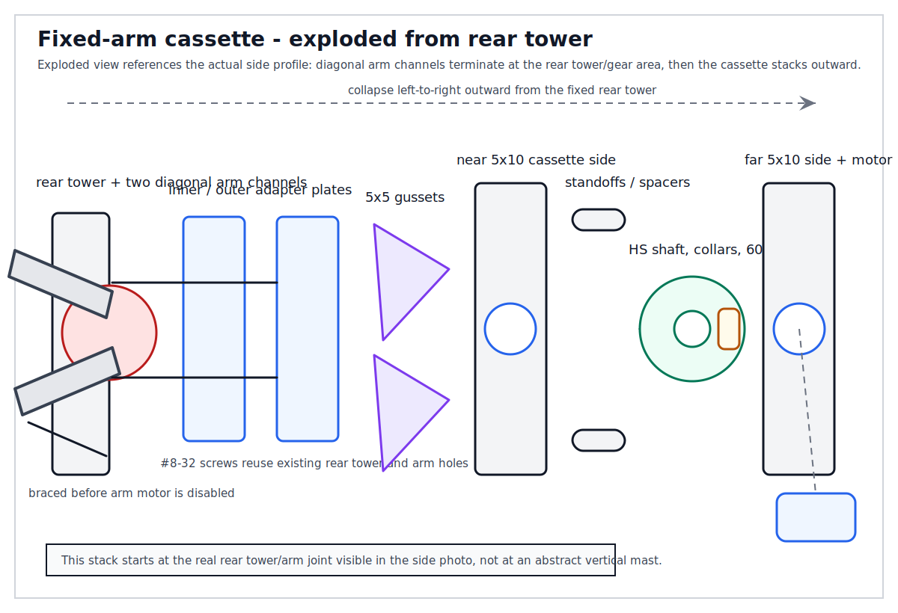
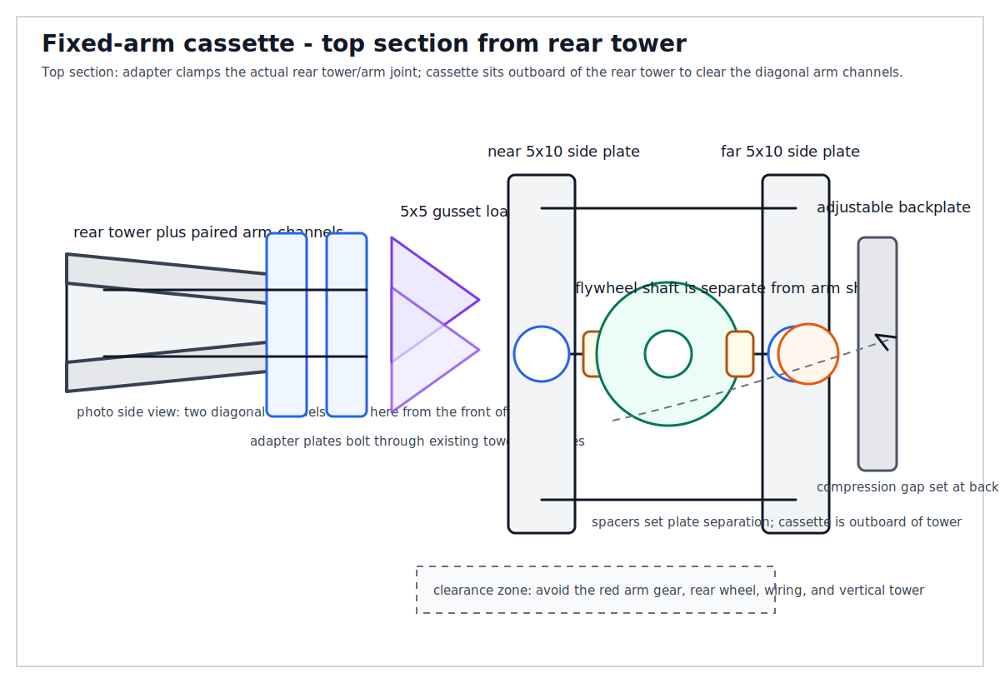

# Fixed-Arm Flywheel Retrofit

A fixed-arm flywheel retrofit converts the VEX V5 Clawbot arm from a moving actuator into a **stationary structural tower** that carries a bolt-on flywheel cassette. The key rule is that **the arm must be mechanically locked with metal structure before the flywheel is attached**. Disabling, unplugging, or removing the arm motor is not enough because it removes active holding torque and does not create a reliable load path for high-speed flywheel vibration.

The current preferred physical layout is now the **red arm extension + blue launcher box** branch. The Home Depot steel straps extend the existing diagonal arm forward past the wheels; the VEX plates sit flat at the front as the launcher side plates and motor mount. The racquetball travels between the blue plates. The rear-tower cassette drawings remain useful as an alternate concept, but they are no longer the preferred geometry for the next review round.

For the foam golf ball revision, keep the same red-extension / blue-launcher-box architecture but shrink the launcher around a golf-ball-sized projectile. The fastest proof-of-function should use the **1/8 in shaft route** from derived_from::[[vex-smart-motor-hs-shaft-flywheel]]: standard shaft through an unmodified VEX plate hole, compression wheel mounted with the included 1/8 in adapter, and a 37 mm starting wheel-rim-to-backplate gap. The HS shaft cassette remains a fallback, but only if the shaft is kept between HS bearings or the plate is drilled/notched for 5/16 in / 8 mm clearance.

The older rear-tower cassette pattern is a sandwich assembly: inner/outer adapter plates bolt through existing arm holes; flywheel side plates mount to the adapter layer; #8-32 standoffs set the plate spacing; bearings on both flywheel plates support the shaft; collars/spacers locate the wheel; and diagonal bracing ties the cassette or fixed arm back to the chassis/tower. This keeps the rotating assembly self-contained and makes the arm interface mostly structural.

For the `5x10 + 5x5` recut option, those labels are VEX hole-grid counts, not inch dimensions. The two `5x10` pieces are nominally 2.5 in x 5.0 in by hole-count times pitch and become the flywheel cassette side plates. The two `5x5` pieces are nominally 2.5 in x 2.5 in and become gussets or motor brackets at the fixed-arm adapter layer. The diagrams use the photographed Clawbot side profile: front lower arm pivots at the left, paired diagonal arm channels rise to the rear tower, and the cassette mounts outboard of the rear tower/arm interface.

Use this pattern when the arm cannot or should not be fully disassembled into C-channel side plates. If spare C-channels are available, the older C-channel frame in relates_to::[[vex-flywheel-structure-parts]] remains valid. If only plates and spacers are available, this retrofit is the safer concept: the former arm becomes the mount, while the cassette carries the motor, bearings, shaft, and flywheel.

Validation checklist before spinning the wheel: arm cannot drift by hand; diagonal brace is installed; both shaft ends are bearing-supported; collars remove side play without binding; wheel clears the arm under vibration; flywheel motor is aligned to the shaft/gear path; former arm motor is removed from commands; wires are strain-relieved; fasteners are tight.

derived_from::[[flywheel-arm-retrofit]]  
derived_from::[[flywheel-plate-recut-plan]]  
relates_to::[[vex-flywheel-disc-launcher]]  
relates_to::[[scoop-and-flywheel-build-diagrams]]  
relates_to::[[vex-v5-motor-cartridges]]  
relates_to::[[vex-v5]]
relates_to::[[vex-smart-motor-hs-shaft-flywheel]]
