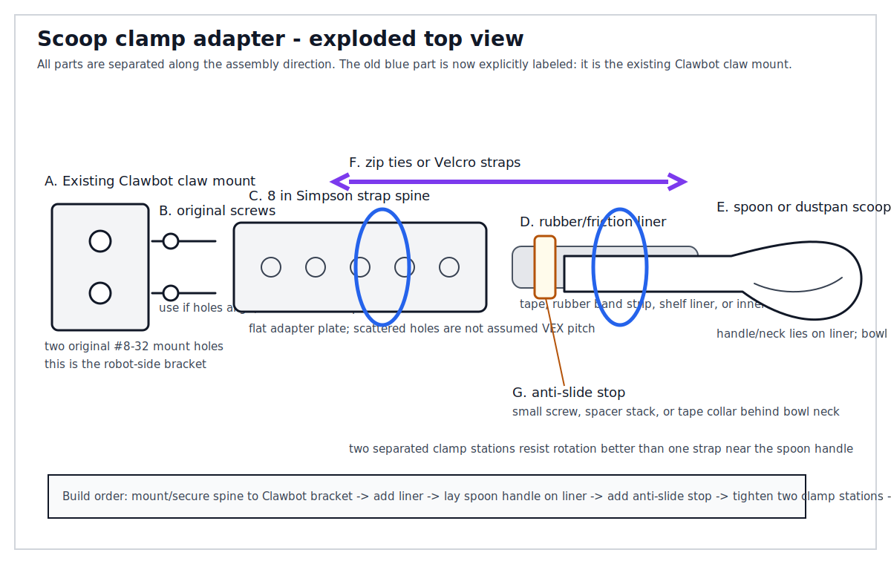
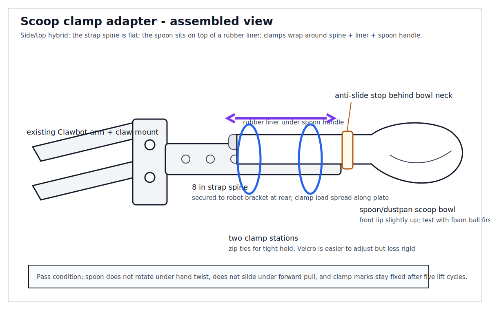
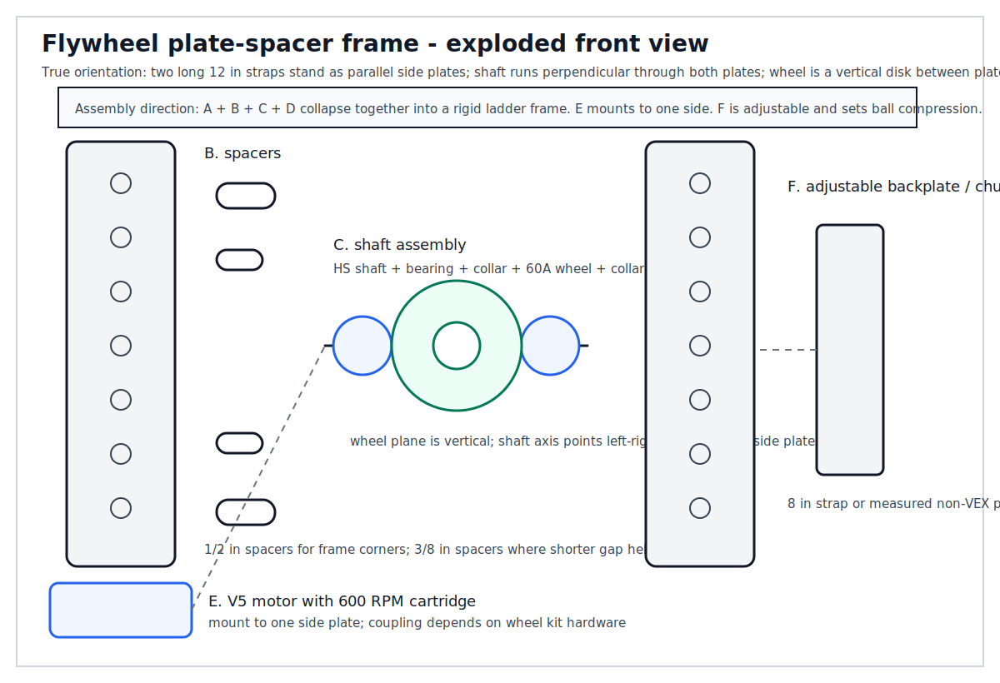
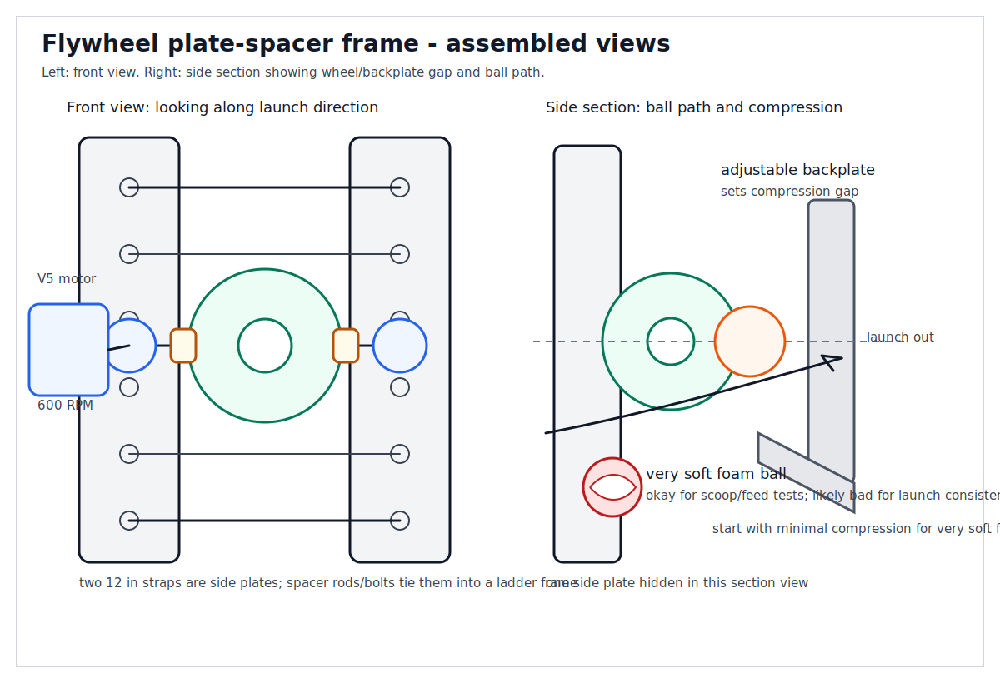
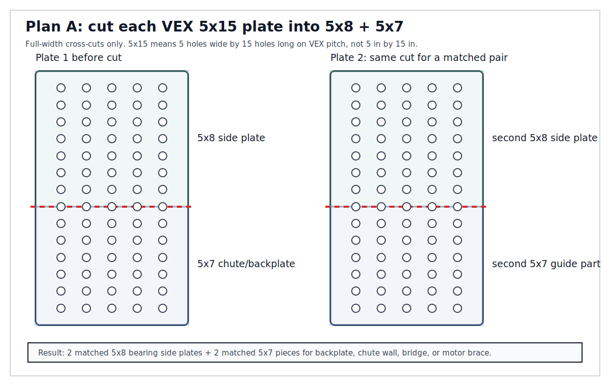
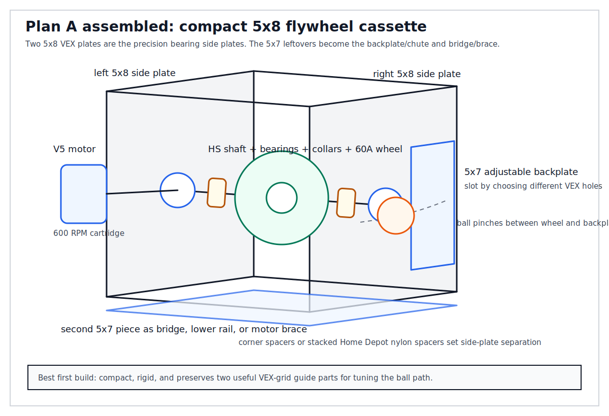
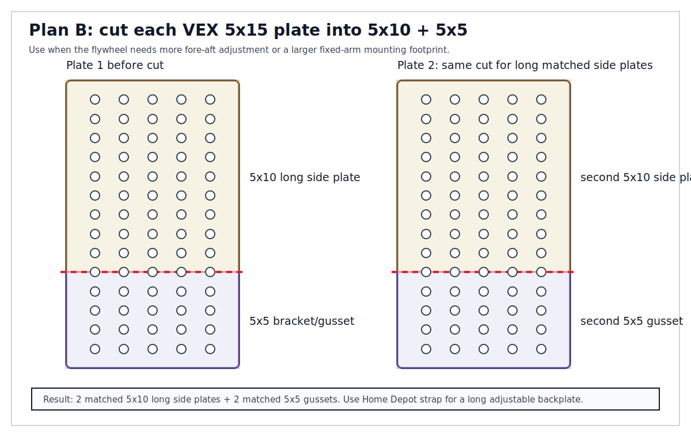
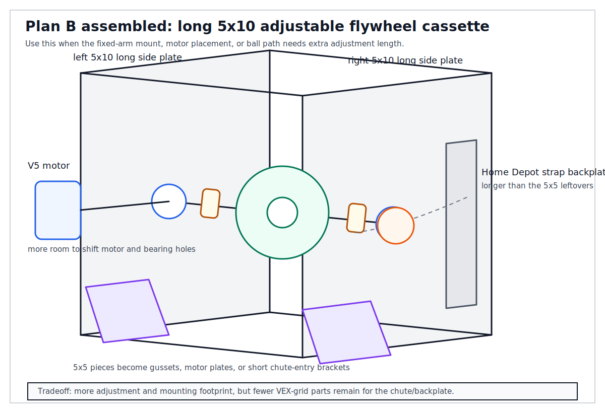
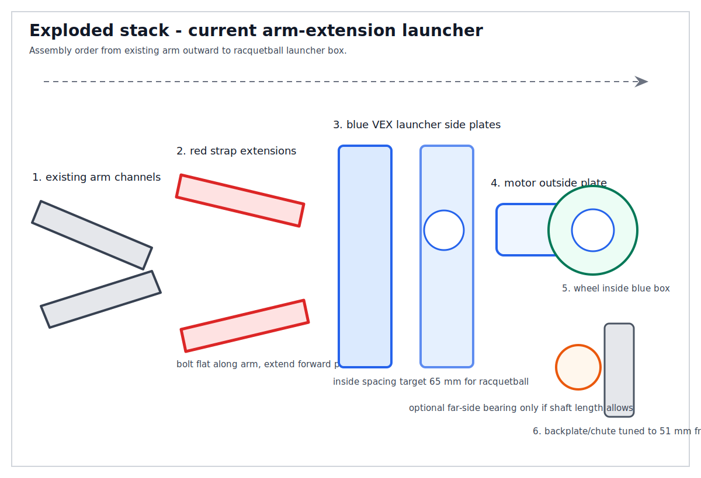

# Scoop and Flywheel Build Diagrams

These line drawings synthesize the current wiki plans for the scoop and flywheel morphologies. They intentionally reflect the 2026-06-25 inventory constraint: no spare U-channels or C-channels, no more VEX orders, two 12 in Simpson strap plates, one 8 in strap plate, four 3/8 in nylon spacers, four 1/2 in nylon spacers, plenty of zip ties/Velcro straps, and very soft foam balls.

## Scoop Clamp Adapter

The current wiki has a direct-drill spoon plan, but the inventory-aware build should prefer a clamp adapter: secure the 8 in strap spine to the original Clawbot claw mount, add a rubber liner, clamp the spoon or dustpan at two separated stations, and add a hard anti-slide stop. This avoids depending on spoon-handle hole geometry. The prior diagram's blue part was the Clawbot claw mount; the revised diagrams label that bracket explicitly.

## Flywheel Plate-Spacer Frame

The flywheel plan remains plausible, but the physical drawing must be read as a test rig rather than a final competition-style launcher: two 12 in strap plates stand as parallel side plates, spacers set separation, the shaft runs perpendicular through the plates, the wheel is a vertical disk between the side plates, and an adjustable backplate/chute sets compression. If the ordered VEX 5x15 plates arrive, they are better precision side plates than the Home Depot straps; if not, the strap plates can still form a prototype frame if the bearing/shaft holes are measured and aligned.

The very soft foam balls are questionable flywheel objects because they compress almost flat and may absorb energy instead of rebounding through the wheel. Use them for scoop and feed tests; for launch data, prefer a racquetball or a less-collapsible foam ball.

## Flywheel Recut Layouts for the VEX 5x15 Plates

derived_from::[[flywheel-plate-recut-plan]] changes the preferred implementation once the VEX 5x15 plates are available. The Home Depot strap-frame drawing above remains useful as a prototype rig, but the actual flywheel cassette should use matched VEX plate pieces for the bearing side plates. The key rule is to make full-width cross-cuts between hole rows; do not lengthwise-cut narrow strips for the bearing supports.

All `5xN` labels in these diagrams are VEX hole-grid counts, not inch dimensions. At 0.5 in pitch, `5x15` is nominally 2.5 in x 7.5 in, `5x10` is nominally 2.5 in x 5.0 in, and `5x5` is nominally 2.5 in x 2.5 in.

**Plan A is the recommended first build:** cut each 5x15 plate into one 5x8 piece and one 5x7 piece. The two 5x8 pieces become the left/right flywheel side plates. The two 5x7 leftovers become the adjustable backplate, chute wall, bridge, lower rail, or motor brace. This gives a compact cassette while preserving enough VEX-grid material for the ball guide.

**Plan B is the adjustment-heavy alternative:** cut each 5x15 plate into one 5x10 hole-grid piece and one 5x5 hole-grid piece. The two 5x10 pieces, nominally 2.5 in x 5.0 in, become longer side plates with more fore-aft mounting room. The two 5x5 pieces, nominally 2.5 in x 2.5 in, become gussets, motor plates, or short chute-entry brackets. Because the 5x5 leftovers are too short for a clean long backplate, use a Home Depot strap as the adjustable backplate in this layout.

## Fixed-Arm Cassette Variant

derived_from::[[flywheel-arm-retrofit]] adds a second diagram pattern for mounting the flywheel frame onto a stationary arm. Instead of assuming the arm is removed and harvested for C-channel, the arm is fixed at a chosen angle, braced back to the chassis/tower, and used as the mounting tower for an adapter-plate layer. The older rear-tower cassette drawings are preserved below as an alternate branch of the plan.

## Current Preferred Flywheel: Red Arm Extensions + Blue Launcher Box

The current preferred hypothesis uses the Home Depot steel straps as **red arm extensions**, not as launcher side walls. These straps bolt flat along the existing arm channels and extend the launcher forward past the wheels. The VEX plates become the **blue launcher box** at the front of those extensions: two flat side plates spaced for a racquetball, with the motor mounted outside one plate and the wheel inside the box.

For a standard 57 mm racquetball, set the blue VEX plate inside spacing to **65 mm target** with **60-70 mm workable**. Set the wheel-rim-to-backplate starting gap to **51 mm**. The ordered 2 in HS shaft may be too short for full two-side bearing support at a 65 mm plate gap, so the physical mockup should either use one-side motor support for review or source a longer shaft/bolt if two-side support is required.

For the current **foam golf ball** revision, the racquetball geometry is superseded as the immediate prototype. Use a golf-ball-sized target of about **42.7 mm** diameter, keep the launcher box near **2 in / 50.8 mm** inside spacing, and start the wheel-rim-to-backplate gap at **37 mm** with a **34-39 mm** adjustment range. Because the ball is smaller and softer, the first build should use the compression wheel kit's **1/8 in shaft adapter path** through normal VEX plate holes. The 1/4 in HS shaft does not fit unmodified plate holes and should be used only as a fallback with a no-drill bearing sandwich or a drilled/notched clearance hole.

## Alternate: Rear-Tower Cassette Variant

This variant is the safer interpretation when the user wants to leave the arm physically present but take the arm motor out of commission. The diagram's assembly order is: existing chassis/tower → mechanically fixed arm → cross/diagonal brace → inner adapter plate → #8-32 screws through existing arm holes → outer adapter/nut side → standoff-spaced flywheel plates → bearings, shaft, collars/spacers, wheel, and flywheel motor.

The explicit 5x10 fixed-arm version uses the Plan B cut: two 5x10 VEX-hole side plates form the cassette walls, and the two 5x5 VEX-hole pieces become gussets or motor brackets at the adapter layer. The side-layout drawing follows the photographed Clawbot profile: front of robot at left, rear tower at right, two diagonal arm channels sloping upward toward the rear tower, and the flywheel cassette mounted outboard of that rear tower/arm interface. The fixed arm is the structural tower; the unmotorized arm shaft is not the flywheel shaft.

derived_from::[[clawbot-scoop-replacement]]  
derived_from::[[vex-order-2026-06-25]]  
derived_from::[[home-depot-inventory-2026-06-25]]  
derived_from::[[flywheel-plate-recut-plan]]  
derived_from::[[vex-flywheel-structure-parts]]  
relates_to::[[vex-flywheel-disc-launcher]]  
relates_to::[[game-object-selection]]
relates_to::[[fixed-arm-flywheel-retrofit]]
relates_to::[[vex-smart-motor-hs-shaft-flywheel]]
