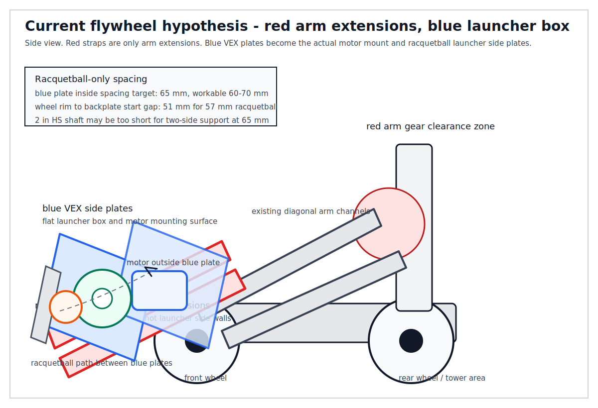
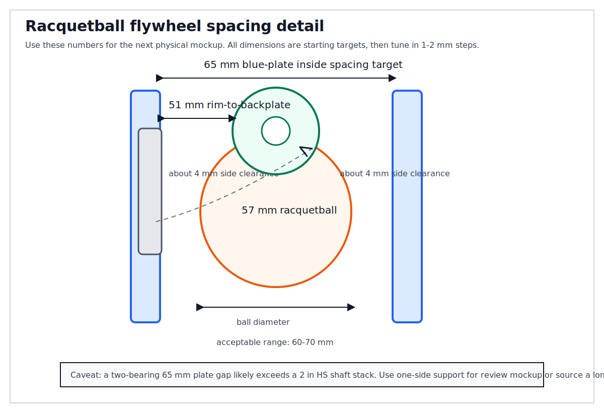

# VEX Flywheel Disc Launcher

A flywheel disc launcher is a **high-speed rotary-wheel mechanism** that launches disc-shaped objects by contacting them with a spinning wheel. It is an alternative end-effector configuration for the VEX V5 Clawbot — an exclusive swap that replaces the arm+claw assembly and expands the [[typed-assembly-grammar]] with a `launch_disc` primitive.

## Mechanism

A spinning flex wheel (or pair of wheels) stores kinetic energy at high RPM. When a disc is fed into the wheel's contact zone, energy transfers to the disc's edge, launching it. Two designs:

| Design | Wheels | Motor(s) | Notes |
|--------|--------|----------|-------|
| **Single flywheel** | 1 spinning wheel + backplate | 1 | Simpler; backplate is angled steel from existing kit |
| **Double flywheel** | 2 contra-rotating wheels | 1–2 | No backplate needed; higher and more consistent exit velocity |

Single flywheel is the standard for entry-level VRC builds and is the minimum viable approach for the capstone self-model loop.

## Required Speed: 6:1 Cartridge

The **6:1 (600 RPM, blue cap) gear cartridge is the critical prerequisite.** The Classroom Starter Kit ships only 18:1 (200 RPM) cartridges — the arm at 18:1 produces only ~28.6 RPM at the flywheel wheel through a 7:1 external train, yielding ~0.45 m/s rim speed. The 6:1 cartridge through the same external ratio yields 4,200 RPM → ~22 m/s rim speed. This difference is the distinction between a slow catapult and a true flywheel launcher.

See relates_to::[[vex-v5-motor-cartridges]] for full cartridge comparison.

## Minimum Individual Parts (from vexrobotics.com)

| # | SKU | Part | Role | Required? |
|---|-----|------|------|-----------|
| 1 | **276-5842** | V5 Motor 6:1 Cartridge (600 RPM) | Motor speed upgrade | **Yes** (if reusing arm motor) |
| 1 | **276-4840** | V5 Smart Motor & Gear Cartridges | Dedicated flywheel motor | Alt. to 276-5842 if adding motor |
| 2 | **217-6449** | Straight Flex Wheel 3" OD 60A (each) | Flywheel contact surface | **Yes** (1 minimum) |
| 3 | **217-7947** | VersaHex Adapters v2 1/4" Sq., 8-pack | Mounts 2" flex wheels on V5 shaft | **Yes** (2 per wheel) |
| — | **217-8079** | Plastic VersaHub v2 (1/2" hex bore) | Required for 3" or 4" wheels | Yes if using 3"+ wheel |
| 4 | **276-8402** | HS Shaft Ball Bearings (11-pack) | Halves friction vs bearing flats | Strongly recommended |
| 5 | **276-8794** | V5 Flywheel Weight 2-pack | RPM stability between shots | Optional |

**Note:** 2" flex wheels (217-6354) avoid the VersaHub requirement, simplifying the assembly — the wheel mounts directly at the motor output shaft via two VersaHex adapters only.

### Foam Golf Ball Prototype — 2026-06-25 Correction

derived_from::[[vex-smart-motor-hs-shaft-flywheel]] corrects the immediate build path for the now-selected foam golf ball. The V5 Smart Motor socket accepts both 1/8 in standard shafts and 1/4 in High Strength shafts, so the motor is not the fit problem. The problem is that a 1/4 in HS shaft does **not** pass through normal VEX steel plate holes unless a 5/16 in / 8 mm clearance hole is drilled or notched.

For the foam golf ball prototype, use the **standard 1/8 in shaft path first**: motor outside the blue VEX plate, 1/8 in shaft through the normal plate hole into the motor socket, and the 2 in compression wheel mounted with the 276-8882 kit's 1/2 in hex to 1/8 in square adapters. Start the wheel-rim-to-backplate gap at **37 mm**, adjustable from **34-39 mm** for a golf-ball-sized foam ball. Switch to the HS shaft path only if the 1/8 in shaft visibly bends, slips, or wobbles.

## Task Telemetry for `launch_disc`

The flywheel launcher produces telemetry that maps cleanly onto the [[task-telemetry-contract]]:

| Signal | Python call | Self-model mapping |
|--------|-------------|-------------------|
| Flywheel speed at shot | `flywheel_motor.velocity(RPM)` | Actual launch RPM → predicted exit velocity |
| Current draw | `flywheel_motor.current(AMP)` | Load; drops post-shot = disc ejected |
| Velocity drop at shot | `velocity_before − velocity_after` | Fraction of stored energy transferred |
| RPM recovery time | time to return to target RPM | Rebound time ↔ flywheel weight effect |
| Observed disc range | AI Vision Sensor / Distance Sensor | Actual vs. predicted range |

Sample `launch_disc` contract:
```json
{
  "task": "launch_disc",
  "predicted": {
    "flywheel_rpm": 600,
    "exit_velocity_ms": 22.0,
    "disc_range_m": 2.0
  },
  "observed": {
    "flywheel_rpm_at_launch": 582,
    "velocity_drop_rpm": 34,
    "current_spike_A": 1.8,
    "recovery_time_ms": 420,
    "disc_range_m": 1.65
  },
  "gap": {
    "rpm_error": -18,
    "range_error_m": -0.35,
    "energy_loss_ratio": 0.057
  }
}
```

The self-model can read this gap and reason: "I predicted 2.0 m range but observed 1.65 m — the flywheel lost 34 RPM at launch; either compression is too high, backplate friction is excessive, or a flywheel weight would reduce the RPM drop."

## Configuration Space Position

`launch_disc` is an **exclusive alternative morphology** — it replaces the `arm+claw` end-effector. The [[typed-assembly-grammar]]'s end-effector node becomes:

```json
{
  "end_effector": ["claw_grasper", "bare_arm", "none", "flywheel_launcher"]
}
```

`flywheel_launcher` requires `cartridge: 600rpm` to be physically viable. With the Starter Kit's 4 motors all occupied, choosing `flywheel_launcher` frees the arm motor for the flywheel while the claw motor becomes unused (or serves as an indexer actuator).

## Ball Bearing Effect

Standard Bearing Flats at flywheel speeds create substantial friction. VEX's own test data shows a bushing-based launcher draws more than double the current of a bearing-based one under identical conditions. Ball bearings (276-8402) are therefore critical for consistent RPM and motor longevity — treating them as optional risks unreliable launch distances in the self-model test loop.

## Structural Frame (from [[vex-flywheel-structure-parts]])

The structural frame for a single flywheel consists of two C-channel side plates, standoffs for spacing, HS Shaft Bearings, and HS Shaft Collars. **When the Clawbot arm is disassembled for the morphology swap, its C-channels are directly reused** — no structural purchase needed. The critical gap vs. the Starter Kit is the shaft support hardware:

| SKU | Part | Role | In Starter Kit? |
|-----|------|------|----------------|
| **276-3521** | HS Shaft Bearing (10-pk) | Supports 1/4" HS shaft — standard Bearing Flats are 1/8" bore only | **No** |
| **276-6102** | HS Clamping Shaft Collar | Retains shaft axially — standard collars are 1/8" bore only | **No** |
| **276-3440** | HS Shaft 2" (4-pk) | Flywheel axle between side plates | No / insufficient |

**Standoff sandwich trick:** 2"/3"/4" HS shafts are ~1mm shorter than same-size #8-32 standoffs. Using standoffs to space the two C-channels lets the shaft rest on HS Shaft Bearings without drilling any new holes in the structural metal.

The motor mounts directly to C-channel with 4× standard #8-32 screws already in the kit. The backplate is any existing steel plate from the kit. Standoffs, screws, keps and nylock nuts are all in the Starter Kit.

### Inventory-Constrained Frame — 2026-06-25

derived_from::[[vex-order-2026-06-25]] changes the immediate build assumption: there are **no spare U-channels or C-channels**. For the next build pass, use a **plate-and-spacer sandwich frame**:

- Use the ordered 5x15 steel plates (SKU 275-2023) as the precision side plates.
- Use existing spacers/standoffs to set the plate separation.
- Mount ordered HS Shaft Bearings (276-3521) to matching plate holes and run the 2" HS shaft (276-3440) through them.
- Retain the shaft with ordered HS clamping collars (276-6102).
- Use non-VEX perforated steel only for a backplate, chute wall, brace, or scoop adapter spine unless its hole spacing is measured and confirmed.

The same principle applies to the scoop: without spare C-channel, a non-VEX perforated plate can serve as the clamp adapter spine for a spoon or dustpan, but it should not be treated as precision VEX structure until measured.

### Recut 5x15 Plate Layouts

derived_from::[[flywheel-plate-recut-plan]] refines the inventory-constrained frame once the two VEX 5x15 plates are available. Treat each 5x15 plate as a 5-hole by 15-hole precision grid, not as inch dimensions; VEX pitch is 0.5 in, so the nominal 5x15 grid span is 2.5 in x 7.5 in. The safest cuts are full-width cross-cuts between hole rows; avoid lengthwise strip cuts for bearing plates because they are more likely to twist or lose shaft alignment.

**Recommended layout: 5x8 + 5x7 from each plate.** The two 5x8 pieces are the matched side plates for the flywheel bearings. The two 5x7 pieces become the adjustable backplate, chute wall, bridge, lower rail, or motor brace. This is the best first build because it makes a compact cassette and leaves useful VEX-grid material for the ball guide.

**Alternate layout: 5x10 + 5x5 hole-grid pieces from each plate.** The two 5x10 pieces, nominally 2.5 in x 5.0 in by hole-count times pitch, are longer matched side plates with more fore-aft adjustment for the motor, shaft, fixed-arm adapter, and ball path. The two 5x5 pieces, nominally 2.5 in x 2.5 in, become gussets or motor brackets. Use a Home Depot strap as the long adjustable backplate because the 5x5 leftovers are too short for that role.

Do not start with a 5x6 + 5x5 + 5x4 split unless the first cassette has already proven the shaft and ball path. It creates many small brackets but no clearly strong matched side plates.

## Fixed-Arm Retrofit Variant

derived_from::[[flywheel-arm-retrofit]] adds a variant for the case where the Clawbot arm is not fully disassembled into flywheel side plates. In this pattern, the former arm is mechanically locked at the desired angle and treated as a tower. Adapter plates bolt through the existing arm holes, then a two-plate standoff cassette carries the flywheel shaft, bearings, collars/spacers, wheel, and motor.

The important constraint is that the old arm motor is only an actuator, not a structural lock. If it is unplugged or removed, the arm must be braced with structural metal before the flywheel cassette is attached. This preserves the same flywheel principles already documented here — 600 RPM cartridge, two-sided shaft support, and rigid plate spacing — while changing the mounting interface from "arm C-channels become the frame" to "fixed arm carries a removable cassette."

The next review-round drawing uses a revised layout: Home Depot steel straps extend the arm forward, and VEX plates form a blue launcher box at the front of those extensions. For the racquetball, the blue plate inside spacing target is 65 mm and the wheel-rim-to-backplate starting gap is 51 mm. This keeps the red straps out of the ball path and gives the blue VEX plates the motor-mounting role.





## Indexer (from [[vex-flywheel-indexer]])

The indexer holds the game piece in staging and pushes it into the flywheel on command. Type depends on motor budget:

- **1-motor flywheel** → freed claw motor (Port 3, 18:1) as roller indexer — zero new parts
- **2-motor flywheel** → ratchet via Motor Clutch 276-1098 (Booster Kit) or 5th motor purchase

See relates_to::[[vex-flywheel-indexer]] for full mechanism comparison and code patterns.

## Ball Compatibility (from [[game-object-selection]])

Although this page uses "disc" in its name and the VEX curriculum framing, **the flywheel mechanism works equally well with spherical balls** in the 55–75 mm diameter range. The critical variable is compression, not shape.

**Compression rule**: target ~10% of object diameter as the gap reduction at the backplate. VEX Nothing But Net teams confirmed 0.35–0.5" (9–13 mm) compression on 4" foam balls at competition. For the capstone:

| Object | Diameter | Backplate gap from wheel rim | Notes |
|--------|----------|----------------------------|-------|
| Racquetball | 57 mm | ~51 mm | Recommended; consistent hollow rubber |
| Small foam ball | 55–70 mm | ~50–63 mm | Easier to tune; more variable shot |
| VEX 4" foam ball | 100 mm | ~90 mm | Proven VRC object; too large for scoop |
| Tennis ball | 67 mm | — | Not recommended — felt grabs wheel unevenly |

Objects with zero compressibility (solid rubber, lacrosse balls) slip over the wheel without launching. Objects too soft (sponge) compress completely and absorb all energy.

For the capstone self-model loop, the **racquetball (57 mm)** is preferred because it fits within all three morphology windows (claw, scoop, flywheel) and can persist across morphology swaps. See [[game-object-selection]] for the full three-window analysis.

exemplified_by::[[vex-launch-disc-parts]]
relates_to::[[vex-flywheel-structure-parts]]
relates_to::[[vex-flywheel-indexer]]
relates_to::[[vex-v5]]
relates_to::[[typed-assembly-grammar]]
relates_to::[[vex-v5-motor-cartridges]]
relates_to::[[task-telemetry-contract]]
relates_to::[[llm-authored-self-model]]
relates_to::[[game-object-selection]]
relates_to::[[fixed-arm-flywheel-retrofit]]
relates_to::[[flywheel-plate-recut-plan]]
relates_to::[[vex-smart-motor-hs-shaft-flywheel]]
